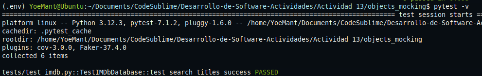
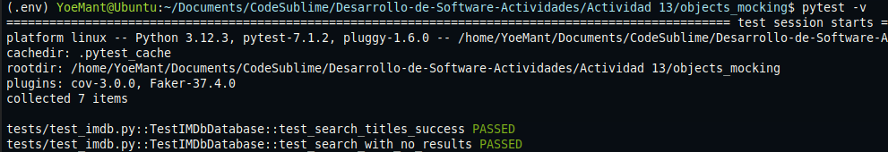
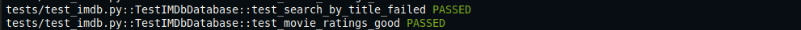

# Actividad 13

**Paso1**

Se implementa una prueba unitaria que realiza una busqueda por titulo en la clase `IMDb`, utilizando el decorador `@patch` para interceptar el método `search_titles`. En lugar de hacer una llamada real a la API se devuelve una respuesta simulada desde el fixture de prueba `GOOD_SEARCH`.

```python
@patch('test_imdb.IMDb.search_titles')
def test_search_by_title(self, imdb_mock):
    """Prueba de búsqueda por título"""
    imdb_mock.return_value = self.imdb_data["GOOD_SEARCH"]
    imdb = IMDb("k_12345678")
    resultados = imdb.search_titles("Bambi")
    assert resultados is not None
    assert resultados.get("errorMessage") is None
    assert resultados.get("results") is not None
    assert resultados["results"][0]["id"] == "tt1375666"
```

Esta prueba demuestra el uso de **mocking a nivel de metodo de clase**, lo que verifica que la logica interna funcione correctamente.



**Paso2**

Se simula una busqueda sin resultados configurando un `Mock` que devuelve un código de estado `404`, emulando una respuesta de error de la API. Se parchea `requests.get` directamente en el módulo `models.imdb`.

```python
@patch('models.imdb.requests.get')
def test_search_with_no_results(self, imdb_mock):
    """Prueba de búsqueda sin resultados"""
    imdb_mock.return_value = Mock(status_code=404)
    imdb = IMDb("k_12345678")
    resultados = imdb.search_titles("Titulo inexistente")
    assert resultados == {}
```

Esta prueba valida que el sistema maneja correctamente errores HTTP y que el método devuelve un diccionario vacío cuando no se encuentran resultados.




**Paso3**

Se prueba un fallo logico simulando una respuesta HTTP pero con un error en el contenido: una **clave API inválida**. El método `requests.get().json()` retorna un objeto con el campo `"errorMessage": "Invalid API Key"`.

```python
@patch('models.imdb.requests.get')
def test_search_by_title_failed(self, imdb_mock):
    """Prueba de búsqueda por título fallida"""
    imdb_mock.return_value = Mock(
        spec=Response,
        status_code=200, 
        json=Mock(return_value=self.imdb_data["INVALID_API"])
    )
    imdb = IMDb("bad-key")
    resultados = imdb.search_titles("Bambi")
    assert resultados is not None
    assert resultados["errorMessage"] == "Invalid API Key"
```

Esta prueba demuestra que el sistema es capaz de manejar errores logicos aún si el codigo de estado HTTP es exitoso (200).



---

**Paso4**

Se prueba el metodo `movie_ratings()` simulando una respuesta correcta con calificaciones para una pelicula. Nuevamente se usa `@patch` sobre `requests.get` y se configura el método `.json()` para devolver `GOOD_RATING`.

```python
@patch('models.imdb.requests.get')
def test_movie_ratings(self, imdb_mock):
    """Prueba de calificaciones de películas"""
    imdb_mock.return_value = Mock(
        spec=Response,
        status_code=200, 
        json=Mock(return_value=self.imdb_data["GOOD_RATING"])
    )
    imdb = IMDb("k_12345678")
    resultados = imdb.movie_ratings("tt1375666")
    assert resultados is not None
    assert resultados["title"] == "Bambi"
    assert resultados["filmAffinity"] == 3
    assert resultados["rottenTomatoes"] == 5
```

Se comprueba que la función interpreta correctamente la estructura JSON retornada por la API y accede a los campos esperados.

