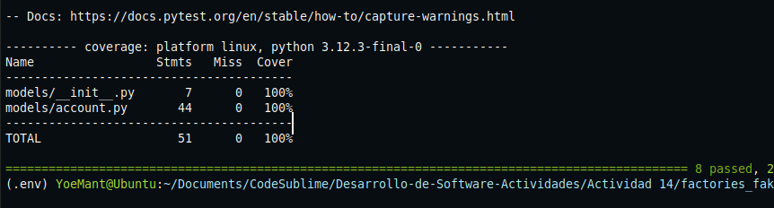
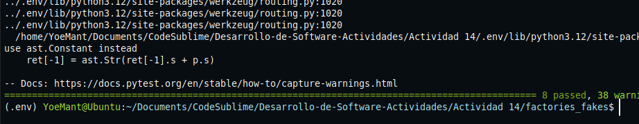
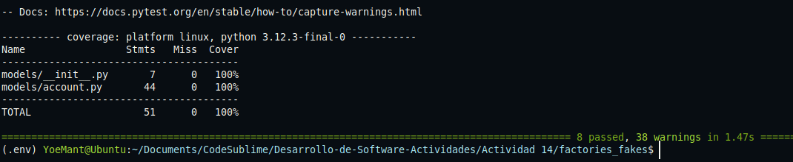

# Actividad 14: Factory y Fakes

**Paso 1**

Ejecutar `pytest --cov=models`:

La salida confirma que todas las pruebas existentes pasan correctamente.


Esto garantiza una base limpia antes de modificar el codigo.


**Paso 2:**

Se creo una clase `AccountFactory` usando la librería `FactoryBoy`, que permite generar objetos `Account` con datos falsos de manera dinámica. Esto evita depender de datos estáticos como `ACCOUNT_DATA`.

Se creó el archivo `tests/factories.py` con el siguiente contenido:

```python
import factory
from datetime import date
from factory.fuzzy import FuzzyChoice, FuzzyDate
from models.account import Account

class AccountFactory(factory.Factory):
    """Crea cuentas falsas"""

    class Meta:
        model = Account

    id = factory.Sequence(lambda n: n)
    name = factory.Faker("name")
    email = factory.Faker("email")
    phone_number = factory.Faker("phone_number")
    disabled = FuzzyChoice(choices=[True, False])
    date_joined = FuzzyDate(date(2008, 1, 1))
```


**Paso 3**

Se actualizo el test para crear 10 cuentas usando `AccountFactory` en lugar de `ACCOUNT_DATA`.

```python
def test_crear_todas_las_cuentas(self):
    """Prueba la creación de múltiples Cuentas"""
    for _ in range(10):
        account = AccountFactory()
        account.create()
    assert len(Account.all()) == 10
```

Se ejecuto `pytest` y paso correctamente.



**Paso 4**

Se reemplaza `ACCOUNT_DATA` por `AccountFactory()` para generar una cuenta de prueba.

```python
def test_crear_una_cuenta(self):
    """Prueba la creación de una Cuenta usando datos conocidos"""
    account = AccountFactory()
    account.create()
    assert len(Account.all()) == 1
```


**Paso 5**

Se verifico que los datos generados por `AccountFactory()` se serializan correctamente.

```python
def test_to_dict(self):
    """Prueba la serialización de una cuenta a un diccionario"""
    account = AccountFactory()
    result = account.to_dict()
    assert account.name == result["name"]
    assert account.email == result["email"]
    assert account.phone_number == result["phone_number"]
    assert account.disabled == result["disabled"]
    assert account.date_joined == result["date_joined"]
```


**Paso 6**

Se valida que `from_dict` funcione correctamente con datos de `AccountFactory`.

```python
def test_from_dict(self):
    """Prueba la deserialización de una cuenta desde un diccionario"""
    data = AccountFactory().to_dict()
    account = Account()
    account.from_dict(data)
    assert account.name == data["name"]
    assert account.email == data["email"]
    assert account.phone_number == data["phone_number"]
    assert account.disabled == data["disabled"]
```

---

**Paso 7**

Se verifico que una cuenta creada con datos falsos puede actualizarse correctamente.

```python
def test_actualizar_una_cuenta(self):
    """Prueba la actualización de una Cuenta usando datos conocidos"""
    account = AccountFactory()
    account.create()
    assert account.id is not None
    account.name = "Rumpelstiltskin"
    account.update()
    found = Account.find(account.id)
    assert found.name == account.name
```

---

**Paso 8**

Se valido que no se puede actualizar una cuenta si su `id` es `None`.

```python
import pytest

def test_id_invalido_al_actualizar(self):
    """Prueba la actualización con un ID inválido"""
    account = AccountFactory()
    account.id = None
    with pytest.raises(DataValidationError):
        account.update()
```


**Paso 9: Actualizar `test_eliminar_una_cuenta()`**

Se probo que una cuenta generada puede eliminarse correctamente de la base de datos.

```python
def test_eliminar_una_cuenta(self):
    """Prueba la eliminación de una Cuenta usando datos conocidos"""
    account = AccountFactory()
    account.create()
    assert len(Account.all()) == 1
    account.delete()
    assert len(Account.all()) == 0
```


**Paso 10**

Como ya no usamos `ACCOUNT_DATA` se elimino su declaración y toda referencia al archivo JSON.


**Resultado Final**

Se ejecuto nuevamente:

```bash
pytest --cov=models
```

Y la salida confirma que todas las pruebas pasan correctamente y la cobertura es del 100%.


