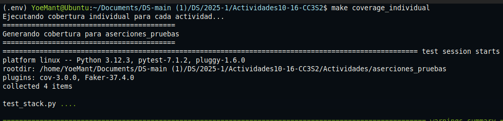
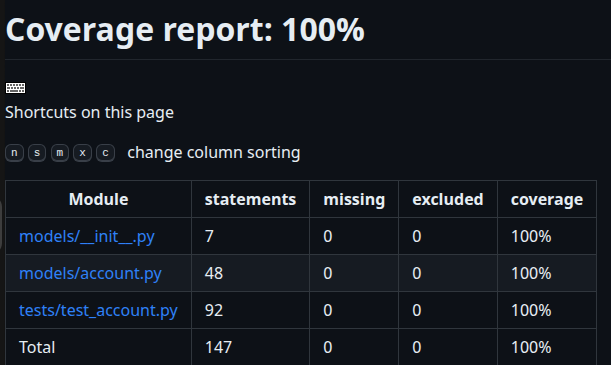
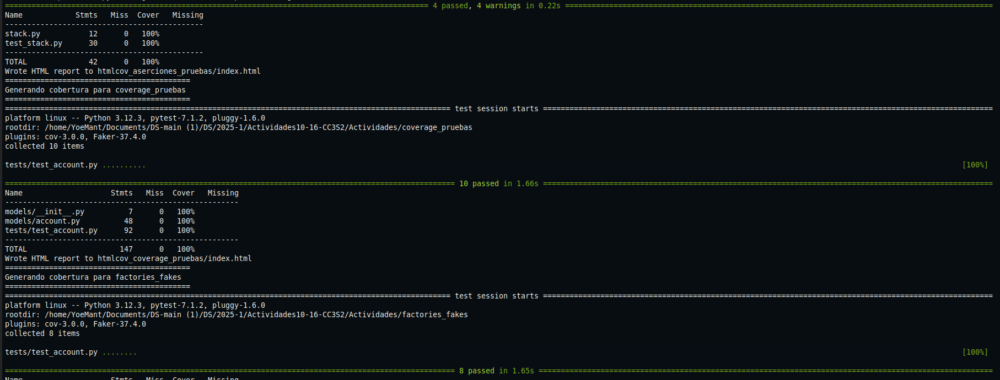
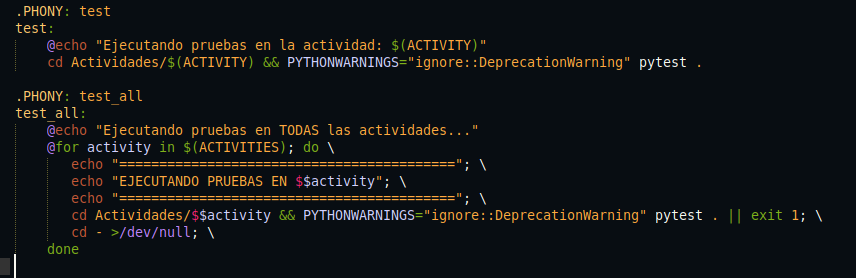
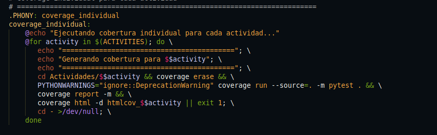

# Actividad 15

## Ejercicio 1: Análisis y evaluación de la cobertura actual


**Paso 1**

Detectar qué partes del código no están cubiertas por pruebas.
```bash
make coverage_individual
```


Entonces, con comando ejecuta los tests de cada actividad del proyecto y genera un directorio HTML con el reporte de cobertura para cada una.


**Paso 2**

Se abre el archivo `index.html` dentro del directorio generado con un navegador:




**Paso 3: Evaluar casos no cubiertos**

Todos los métodos (`update`, `delete`, `from_dict`, etc.) están completamente cubiertos. Las pruebas ya consideran tanto caminos positivos como negativos en los condicionales.

**Paso 4: Documentar observaciones**

No se detectan métodos o ramas sin probar, cobertura del 100% confirma que todas las funciones, clases y condiciones fueron ejercitadas correctamente.


## Ejercicio 2: Ampliar las pruebas para mejorar la cobertura


**1. Metodos de serialización:**

- `to_dict`: Se verifico que todas las columnas estén presentes, incluso con valores None.

- `from_dict`: Se probaron diccionarios incompletos y con claves inválidas para validar el comportamiento.


**2.Métodos CRUD:**

- `create`: Se comprobo que se genere correctamente el id al guardar una nueva cuenta.

- `update`: Se añadio una prueba que modifica multiples campos y se valida el cambio en base de datos.

- `delete`: Se valido que una cuenta eliminada ya no aparece al usar `find()` o `all()`.

**3.Métodos de clase:**
- `all`: Se probo el caso de base de datos vacía.

- `find`: Se evaluaron casos con ID inexistente y tipos no esperados.

## Ejercicio 3: Ampliación y optimización del Makefile

Se automatizaa mas tareas y facilitar la ejecución de pruebas y validaciones.

**`make lint`**

Con este bloque en el Makefile:

```makefile
.PHONY: lint
lint:
    @echo "Ejecutando flake8..."
    flake8 .
```
Con esto se verifica que el código siga buenas prácticas y estilos definidos en PEP8.


**`make coverage_all`**

```makefile
.PHONY: test_all
test_all:
    @echo "Ejecutando pruebas en TODAS las actividades..."
    @for activity in $(ACTIVITIES); do \
       echo "=========================================="; \
       echo "EJECUTANDO PRUEBAS EN $$activity"; \
       echo "=========================================="; \
       cd Actividades/$$activity && PYTHONWARNINGS="ignore::DeprecationWarning" pytest . || exit 1; \
       cd - >/dev/null; \
    done
```

Con esto ejecutamos los tests de todas las actividades, combina los datos de cobertura y genera un único reporte.


**`make clean`**

```makefile
.PHONY: clean
clean:
    @echo "Eliminando archivos de caché y reportes..."
    find . -type d -name "__pycache__" -exec rm -rf {} +
    rm -rf .pytest_cache
    rm -rf htmlcov htmlcov_*
    coverage erase
    @echo "Limpieza completa."
```
Limpia archivos innecesarios y reportes anteriores.

