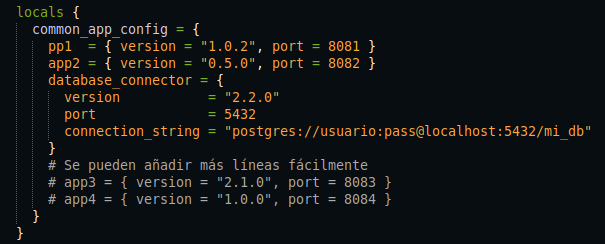
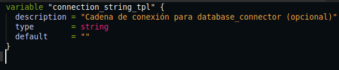
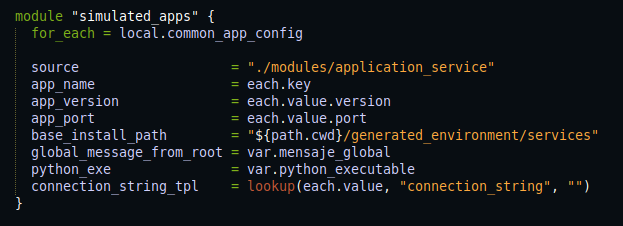
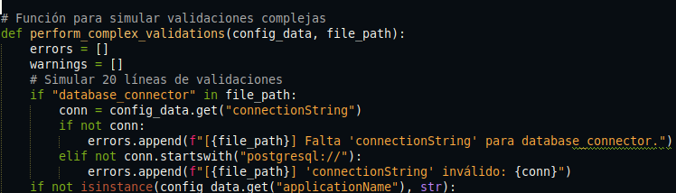

# Actividad 19

#### **Ejercicio 1: Ejercicio de evolvabilidad y resolución de problemas:**

**1. Modificar `main.tf` para incluir el nuevo servicio**

Se agrega una entrada llamada `database_connector` al mapa `common_app_config`,
este nuevo servicio tiene un `port` y un nuevo parámetro llamado `connection_string` con el cual sera usado para el `config.json`.

**Agregamos una nueva variable en variables.tf**

Este va a definir una nueva variable para el modulo `application_service`. Con esta variable opcional va a permitir recibir la cadena de conexión como entrada y por defaul ninguna

**Se modifica el bloque del modulo `application_service` en `main.tf`**

Pasamos el nuevo campo `connection_string` al modulo y
para los servicios `app1` y `app2` este valor será vacio y no se incluirá en el `config.json`, y  para `database_connector` se incluira porque está definido.

**Se actualizar `validate_config.py`**

Si el nombre de la aplicación es `database_connector`, entonces  se debe haber un campo `connection_string`, y si no se cumple, se añade un error en la validación.
