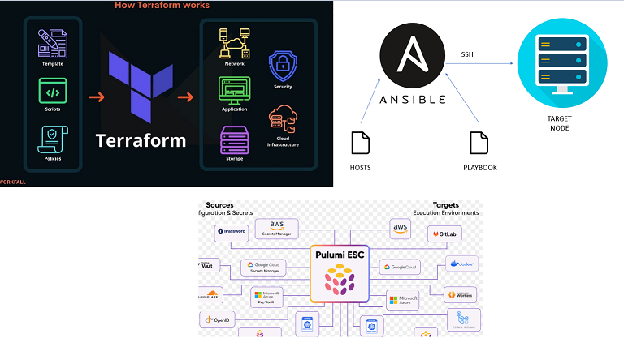
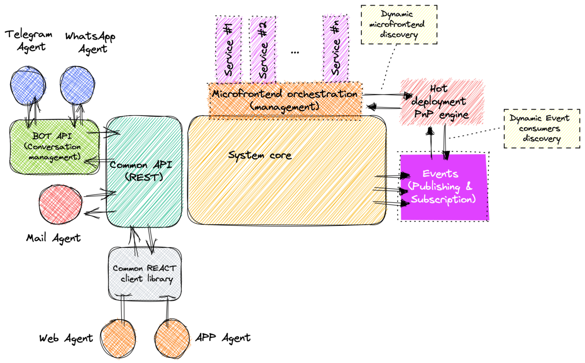
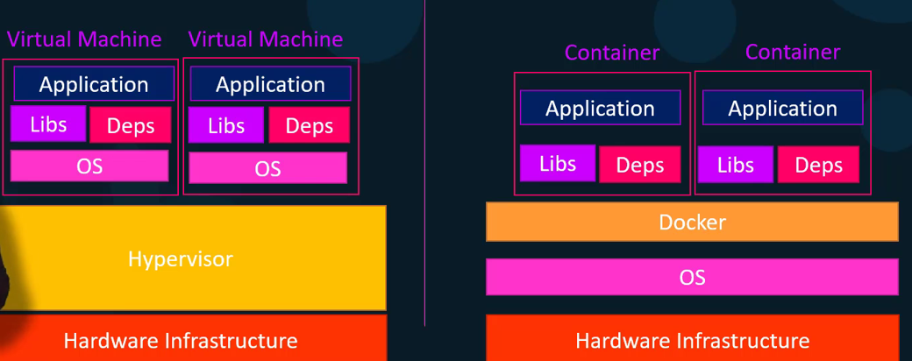
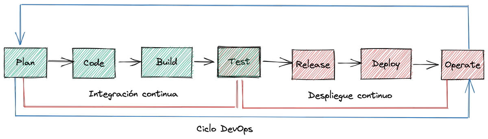
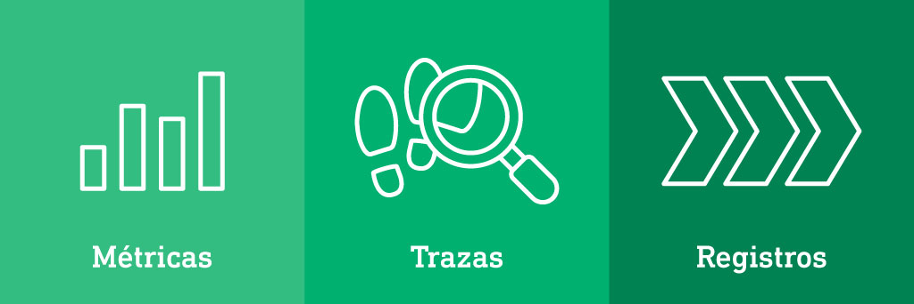
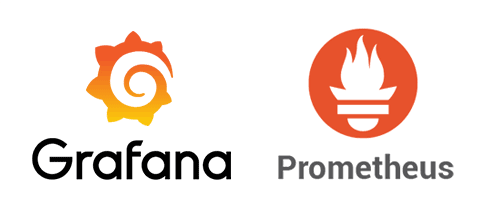
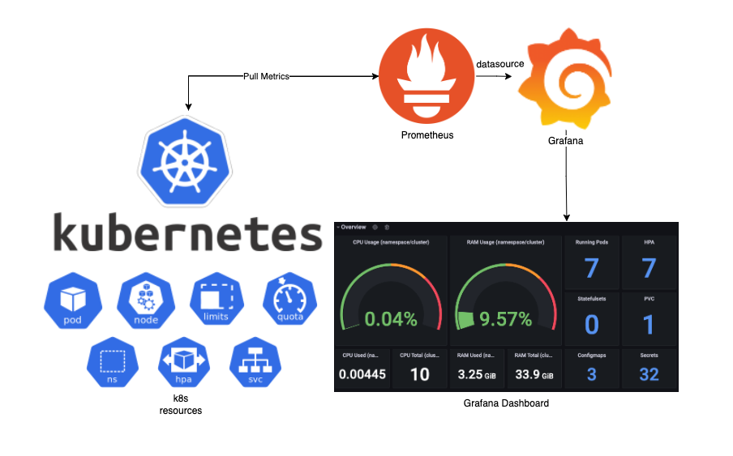

# **A. Infraestructura como Código**


## **Introducción a IaC**

**¿Qué es IaC y por qué es un cambio de paradigma?**  
La IaC es una forma de gestionar la infraestructura como servidores, redes o bases de datos mediante código, en vez de hacerlo manualmente desde una consola o panel web. Es un cambio de paradigma porque antes todo se hacía a mano y eso podía causar errores o inconsistencias entre ambientes, ahora se puede automatizar, repetir y controlar todo como si fuera software, lo cual mejora la calidad y ahorra tiempo.


**Beneficios:**  
- En la consistencia, todos los entornos se crean igual, sin diferencias accidentales y en los controle de versiones se pueden ver qué cambios se hicieron, cuándo y por quién, como con el código normal. La automatización
puede crear y destruir infraestructura automáticamente con un solo comando. Lo que implica 
menos errores humanos ya que no se hace manualmente y se evitan errores por descuido.

## **Escritura de IaC**

**Herramientas populares:**  
Algunas de estas herramientas más conocidas son:  
- **Terraform:** que es muy usada y compatible con varios proveedores como lo son AWS, Azure entre otros.  
- **Ansible:** este se enfoca mas en configuración, usa YAML para manejarlo.  
- **Pulumi:** usa lenguajes de programación tradicionales como Python o TypeScript.  
**Buenas prácticas:**  
- Usar nombres descriptivos para los recursos.  
- Declarar variables para valores que pueden cambiar.  
- Dividir el código en módulos reutilizables.  
- Usar Git para llevar el control de cambios.



## **Patrones para módulos**

- **Modularización:** ayuda a dividir la infraestructura en partes lógicas según su función, como:
  - `network` 
  - `database` 
  - `application` 

- Cada módulo se guarda en su propia carpeta con archivos como:
  - `main.tf` 
  - `variables.tf` 
  - `outputs.tf` 

Esto permite **reutilizar, mantener y escalar** la infraestructura de forma más ordenada y eficiente.


## **Patrones para dependencias**

**Gestión de dependencias entre módulos:**  
Un módulo necesita información de otro, como por ejemplo el módulo de aplicación donde se necesita saber el nombre o las credenciales del módulo de base de datos. Esto se hace con outputs e inputs.

- El módulo de base de datos tiene un `output` con la credencial.  
- El módulo de aplicación lo recibe como `input` y lo usa para conectarse.  

De esta manera enlazan los módulos de forma ordenada y clara.





## **Tarea teórica**

Terraform utiliza un sistema modular jerárquico que permite organizar la infraestructura como código (IaC) en componentes reutilizables y autocontenidos. Su arquitectura se basa en módulos raíz (root modules) que pueden invocar módulos hijos (child modules), ya sea locales o remotos, siguiendo principios de encapsulación y abstracción

**Propuesta de estructura para proyecto con tres módulos**:

```
terraform-project/
├── modules/
│   ├── network/
│   │   ├── main.tf         
│   │   ├── variables.tf    
│   │   ├── outputs.tf      
│   │   └── README.md       
│   ├── database/
│   │   ├── main.tf         
│   │   ├── variables.tf    
│   │   └── outputs.tf      
│   └── application/
│       ├── main.tf         
│       ├── variables.tf    
│       └── outputs.tf      
├── environments/
│   ├── dev/
│   │   ├── main.tf         
│   │   └── variables.tf    
│   └── prod/
│       ├── main.tf         
│       └── variables.tf    
├── examples/               
│   └── basic-deployment/
│       └── main.tf
└── README.md               
```

1. **Separación de responsabilidades**:  
   Se separa por partes como red, base de datos y aplicación. Así cada una se puede usar en más de un ambiente, actualizar sin malograr otras partes y también se puede probar por separado.

2. **Carpeta de entornos**:  
   Lo de environments es para tener diferentes configuraciones, por ejemplo una para pruebas y otra para cuando ya está todo en producción . Así no se toca el módulo base y todo se mantiene más estable.

3. **README**:  
   Los archivos de documentación ayudan a saber qué hace cada módulo y cómo usarlo. También ayuda a ver cómo se despliega algo básico.

4. **Conexión entre módulos**:  
   Los módulos se pasan datos entre sí con variables. Por ejemplo, la base de datos puede usar lo que crea el módulo de red. No es necesario saber qué hay dentro, solo usar lo que el otro módulo le entrega:

# B. Contenerización y despliegue de aplicaciones modernas
## 1 Contenerización con Docker
**¿Qué son los contenedores?**
Los contenedores empaquetan todo lo que una app necesita, como código, librerías, dependencias entre otros para que funcione igual en cualquier entorno, a diferencia de las máquinas virtuales, no necesitan un sistema operativo completo, ya que comparten el kernel del SO anfitrión. Esto los hace más ligeros, rápidos y eficientes.

El aislamiento se logra con tecnologías como **namespaces** y **cgroups**, que separan recursos entre contenedores. Mientras las VMs usan hipervisor y OS por cada instancia, los contenedores pueden ejecutarse sobre un solo sistema, optimizando recursos y tiempos de arranque.




**Dockerfile básico**:  
```dockerfile
FROM python:3.12  # imagen base
WORKDIR /app       # directorio de trabajo
COPY . .           # copia código
RUN pip install -r requirements.txt  # instala dependencias
EXPOSE 8080        # Puerto
CMD ["python", "app.py"]  # iniciando comando
```

**Imagen vs Contenedor** :

| **Imagen**                   | **Contenedor**           |
|-----------------------------|---------------------------|
| Plantilla inmutable         | Instancia ejecutable      |
| Creada con `docker build`   | Iniciada con `docker run` |
| Almacenable en registros    | Efímero/modificable       |


## 2 Orquestación con Kubernetes
**Componentes clave** :  
1. **Pod**: Es la unidad mínima que agrupa contenedores 
2. **Deployment**: Gestiona ciclo de vida de pods para controlar actualizaciones
3. **Service**: Punto de acceso estable a pods  para exponer y balancer trafico
4. **ReplicaSet**: Asegurar que haya la cantidad deseada de Pods corriendo 

**Manifiesto YAML** :  
```yaml
apiVersion: apps/v1
kind: Deployment
metadata:
  name: app-deployment
spec:
  replicas: 3
  selector:
    matchLabels:
      app: my-app
  template:
    metadata:
      labels:
        app: my-app
    spec:
      containers:
      - name: app-container
        image: my-registry/app:v1.2
        ports:
        - containerPort: 8080
```

**Estrategias de despliegue** :  
1. **Rolling Update** :  
   - Va cambiando de versión a la nueva poco a poco, sin tumbar todo  
  
2. **Canary Release**:  
   - Muestra la nueva versión solo a un grupo reducido, si todo va bien, se amplía.

3. **Blue-Green**:  
    Existen dos entornos en paralelo uno viejo y uno nuevo, donde uno esta activo y el otro esta listo para realizar el cambio. Cuando pruebas el nuevo, cambias todo el tráfico a el.

## 3 Flujo de despliegue continuo

El ciclo de vida del despliegue en DevOps sigue varios pasos que van desde que el desarrollador escribe el código hasta que la aplicación se pone en funcionamiento:

**Desarrollo**:
El programador hace cambios en el código y los guarda en el repositorio.

**Build**:
Se toma ese código y se empaqueta para que pueda ejecutarse.

**Test**:
Se hacen pruebas automáticas para verificar que el código funciona bien y no rompe nada.

**Deploy**:
Si todo va bien, el sistema lanza esa nueva versión al entorno como producción o pruebas.

### **Herramientas**
-Docker y Kubernetes se integran en los pipelines de despliegue continuo para automatizar todo el proceso.

-Docker se usa para crear una imagen con la app lista para ejecutarse.

-Kubernetes toma esa imagen y la despliega automáticamente en el entorno (como producción), manejando el escalado y la actualización.

# C. Observabilidad y Troubleshooting (explicado simple)
 
La obserbabilidad es tener una visión total de lo que pasa dentro de una app o sistema. Va más allá del simple monitoreo, esto ingluye 3 pilares fundamentales:

- **Logs:** Mensajes que dicen que está haciendo el sistema.  
- **Métricas:** Números como uso de CPU, memoria, tráfico, etc.  
- **Trazas:** El recorrido que hace una petición dentro del sistema.

Estas presentan las siguientes ventajas:  
- Para **detectar errores rápido**, incluso antes de que los usuarios se quejen.  
- Para **optimizar recursos** (por ejemplo, saber si un servidor está muy cargado).  
- Para obtener **datos útiles para el negocio**, como ver qué partes de la app se usan más.


### Herramientas clave

- **Prometheus:**  
  Es una herramienta que recolecta **métricas** como el uso de CPU, memoria, o cuántas peticiones recibe una app. Usa un lenguaje llamado **PromQL** para hacer consultas y analizar esos datos.

- **Grafana:**  
  Se usa para ver las métricas en gráficas y paneles bonitos. También permite poner alertas si algo se sale de lo normal.

- **Otros sistemas:**  
  - **ELK (ElasticSearch, Logstash, Kibana):** Sirve para analizar logs (mensajes del sistema).  
  - **Jaeger:** Se usa para ver el camino que sigue una petición dentro de una app grande, ideal para **trazas distribuidas**.
  

  
### Estrategias de troubleshooting

- **Triage de problemas:**  
 Se revisan los dashboards y las alertas para ver si algo raro está pasando y dónde.

- **Diagnóstico:**  
  Una vez detectado el problema, se revisan los logs y las métricas en tiempo real. También se comparan eventos para ver qué causó el error.

- **Resolución:**  
  Se actúa para solucionar el problema, por ejemplo:  
  - Hacer rollback a una versión anterior que sí funcionaba.  
  - Escalar manualmente si hay mucho tráfico.  
  - Cambiar la configuración de los servidores o la app para corregir el fallo.

Perfecto, con esta imagen como apoyo visual, se puede mejorar la explicación anterior haciéndola aún más clara y sencilla, así:


### Tarea teórica

**¿Cómo se integran Prometheus y Grafana con Kubernetes?**

La imagen muestra claramente cómo funciona la integración:

1. **Kubernetes** expone métricas sobre los recursos del clúster: pods, nodos, CPU, memoria, servicios, etc.
2. **Prometheus** se conecta a Kubernetes y extrae ("pull") esas métricas automáticamente.
3. **Grafana** usa a Prometheus como fuente de datos para mostrar esa información en gráficas y paneles personalizados.
4. Abajo se ve un Dashboard de Grafana, donde se muestra el uso de CPU, memoria, cantidad de pods en ejecución, etc.

Gracias a esta integración, los equipos pueden monitorear el estado del clúster y los contenedores en tiempo real.
  


---
