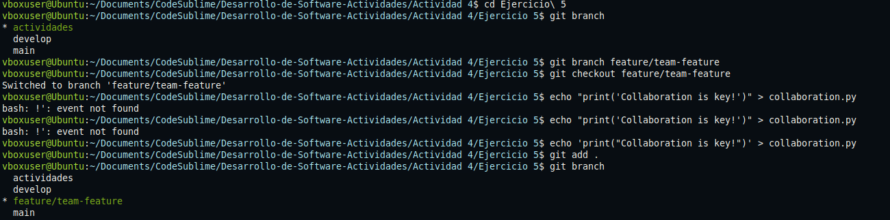
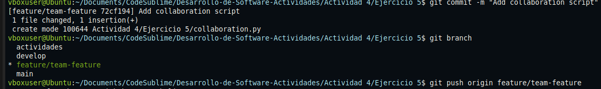
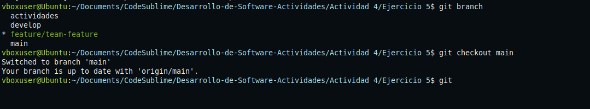
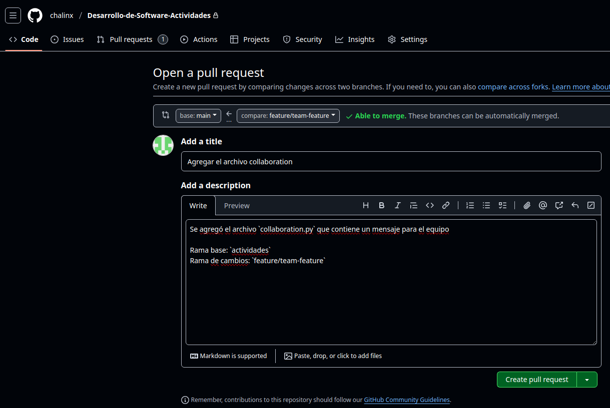
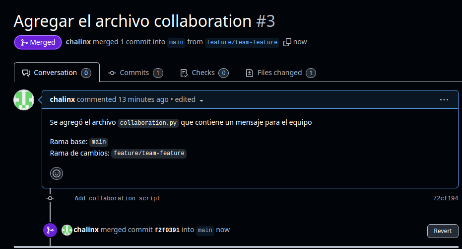

1. **Creación de rama:**  
   Se creó una nueva rama llamada `feature/team-feature` para trabajar de forma aislada de la rama principal `main`.

2. **Edición y commit:**  
   Se agregó el archivo `collaboration.py` con un mensaje y se añadió al staging con `git add .` y se guardó en el historial de cambios con un commit.

3. **Push al repositorio remoto:**  
   Se subió la rama al repositorio en GitHub.

4. **Creación del Pull Request (PR):**  
   En GitHub se abrió un PR para solicitar la fusión de los cambios en la rama `main`.

5. **Eliminación de la rama local:**  
   Se eliminó la rama `feature/team-feature` del entorno local con el comando.

6. **Eliminación de la rama remota:**  
   Finalmente, se eliminó la rama del repositorio remoto en GitHub .

---

