## Ejercicio 1

### Simulación de una fusión fast-forward
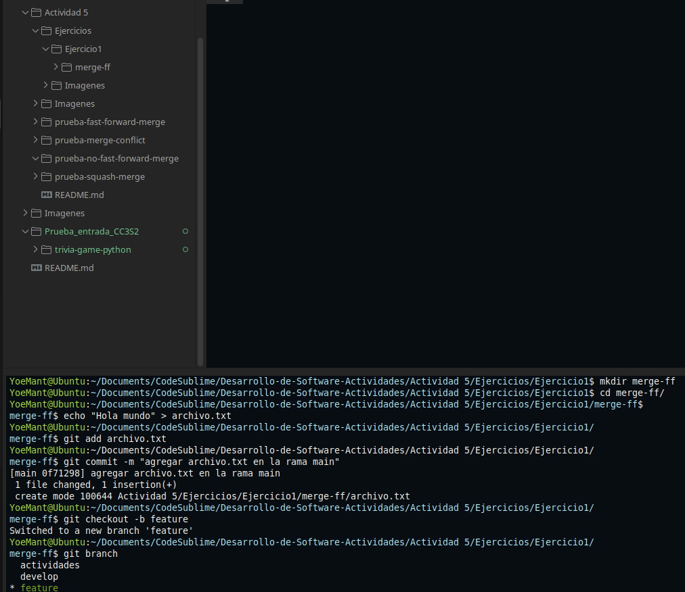
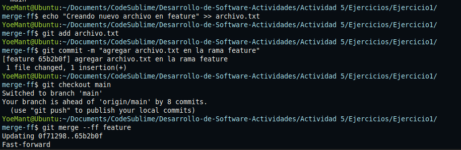
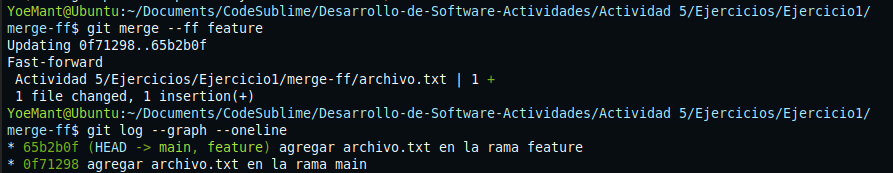
En este caso no buscamos un repositorio, sino que cree la rama y la adapte al problema.

1. **Creación del entorno de trabajo**  
   Se creó una carpeta llamada `merge-ff` para practicar el uso de fusiones en Git dentro de la carpeta ejercicio 1.

2. **Inicialización y commit inicial en `main`**  
   Se creó un archivo llamado `archivo.txt` con un mensaje simple y se guardó el cambio en la rama principal (`main`) con un commit inicial.

3. **Creación de una nueva rama `feature`**  
   Desde `main`, se creó la rama `feature` para trabajar de manera aislada sin afectar directamente el código principal.

4. **Modificación del archivo en `feature`**  
   En la rama `feature`, se añadió contenido nuevo al archivo `archivo.txt`, y se registró el cambio con un nuevo commit.

5. **Cambio a la rama `main` para integrar cambios**  
   Se volvió a `main` con la intención de fusionar los cambios hechos en `feature`.

6. **Fusión fast-forward**  
   Como `main` no había recibido cambios adicionales desde que se creó `feature` entonces Git aplicó una fusión fast-forward, esto simplemente avanzó el puntero de `main` hasta el último commit de `feature` sin crear un commit de fusión adicional.

7. **Verificación del historial**  
   Al ejecutar `git log --graph --oneline`, se mostró un historial lineal, con los commits de ambas ramas alineados como si hubieran sido hechos directamente en `main`.

---

### Pregunta: ¿En qué situaciones recomendarías evitar el uso de `git merge --ff`?

Aunque `git merge --ff` mantiene un historial limpio y lineal, **puede no ser ideal en todos los casos**.

   Al no crear un commit de fusión se pierde el rastro explícito de que hubo una rama de trabajo `feature`, esto en equipos grandes hace que se complique el seguimiento de tareas individuales. Tambien no queda registrado cuando se integró una funcionalidad completa lo que puede dificultar la revisión del código.
   En entornos colaborativos es útil ver con claridad qué ramas se integraron y cuándo. Las fusiones sin `--ff` dejan este registro automáticamente. POr eso algunos equipo prefieres usar `--no-ff` para que se integre en la documentacion.

---

## Ejercicio 2

### Fusión con `--no-ff` y resolución de conflicto
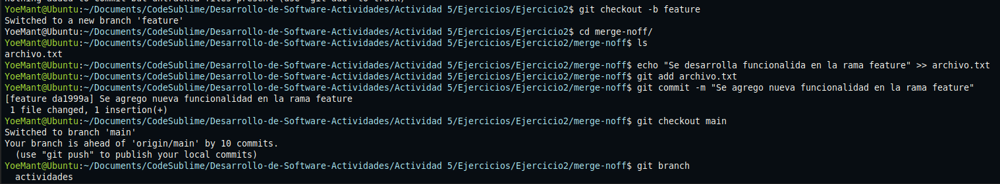
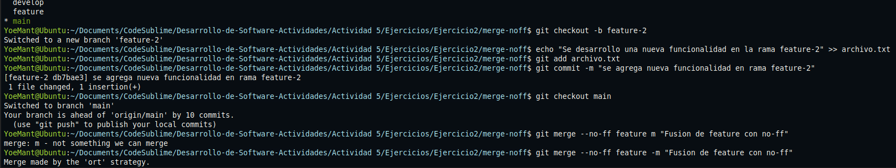
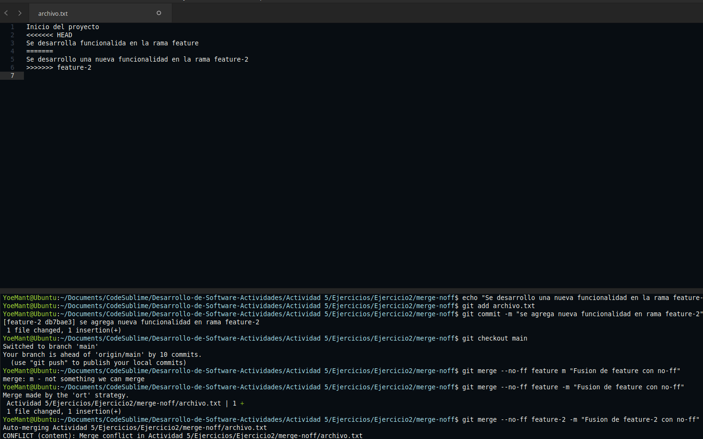
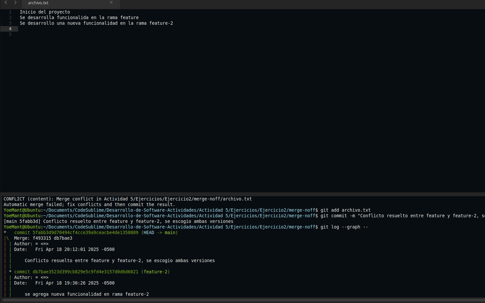
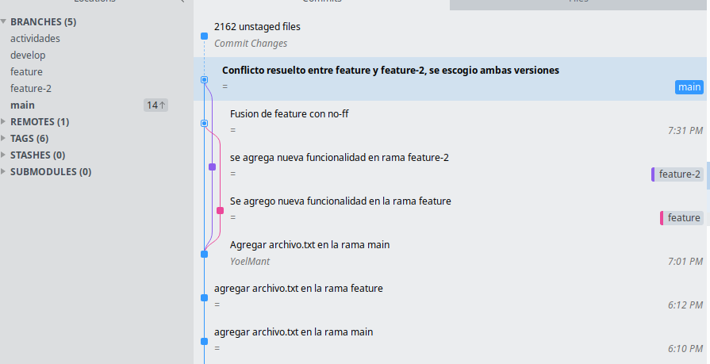
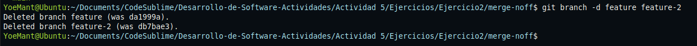

1. **Inicialización del entorno de trabajo**  
   Se preparó el directorio `merge-noff` dentro del ejercicio 2 y se creó el archivo `archivo.txt` con un contenido. Se hizo el primer commit en la rama `main`.

2. **Creación de la rama `feature`**  
   Desde `main`, se creó la rama `feature`. En esta rama se añadió una línea al archivo `archivo.txt` describiendo una funcionalidad, y se guardó el cambio con un commit.

3. **Creación de la rama `feature-2`**  
   Se volvió a `main` y se creó una nueva rama llamada `feature-2`. En esta rama se agregó otra línea distinta al mismo archivo `archivo.txt` y se hizo un nuevo commit.

4. **Fusión de `feature` en `main` con `--no-ff`**  
   Se volvió a `main` y se realizó una fusión con la rama `feature` utilizando `git merge --no-ff`. Como los cambios no eran conflictivos, la fusión fue exitosa y se creó un commit de fusión.

5. **Fusión de `feature-2` en `main` con `--no-ff`**  
   A continuación, se intentó fusionar `feature-2` también con `--no-ff`. Esta vez Git detectó un **conflicto** en el archivo `archivo.txt`, ya que ambas ramas habían realizado modificaciones en la misma parte del contenido.

6. **Identificación del conflicto**  
   Git marcó el conflicto dentro de `archivo.txt` con delimitadores especiales (`<<<<<<<`, `=======`, `>>>>>>>`). Estos indican las diferencias entre lo que hay en `main` y lo que viene de `feature-2`.

7. **Resolución del conflicto**  
   Se editó el archivo para eliminar las marcas de conflicto y combinar manualmente ambas líneas de código de las dos ramas y se guardo. y se añadió nuevamente `git add archivo.txt`.

8. **Visualización del historial con `git log`**  
   Para verificar la estructura del historial usamos `git log --graph --oneline`, el cual muestra un **árbol de commits** con las ramas y los puntos de fusión claramente identificados, tambien se uso sublime Merge para ver mas detallado el estructura del historial. Esto permite observar cómo las ramas `feature` y `feature-2` fueron integradas a `main` con sus respectivos commits de fusión.
9. **Eliminación de las ramas integradas**
   Finalmente, se eliminaron las ramas feature y feature-2 con git branch -d, ya que sus cambios ya fueron fusionados en main

---
### Preguntas:¿Cuáles son las principales ventajas de utilizar git merge --no-ff en un proyecto en equipo?¿Qué problemas podrían surgir al depender excesivamente de commits de fusión

### Ventajas de usar
Permite mantener un historial más claro ya que cada fusión genera un commit que muestra cuándo y qué rama fue integrada. Esto facilita el seguimiento de cambios en proyectos colaborativos y mejora la organización del flujo de trabajo.

#### Problemas al abusar
Puede generar un historial más extenso y difícil de leer si se crean commits de fusión innecesarios. Además, si se acumulan muchas ramas sin fusionar, aumenta la probabilidad de conflictos y se pierde simplicidad en el manejo del repositorio.

## EJercicio 3

### Fusión con `--squash` para aplanar múltiples commits
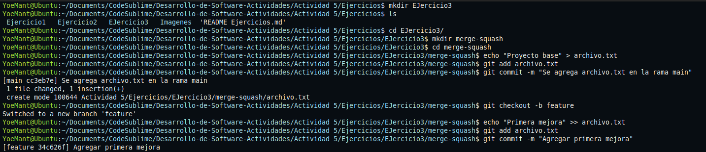
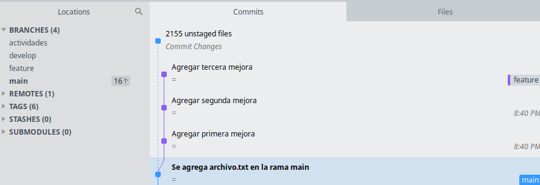
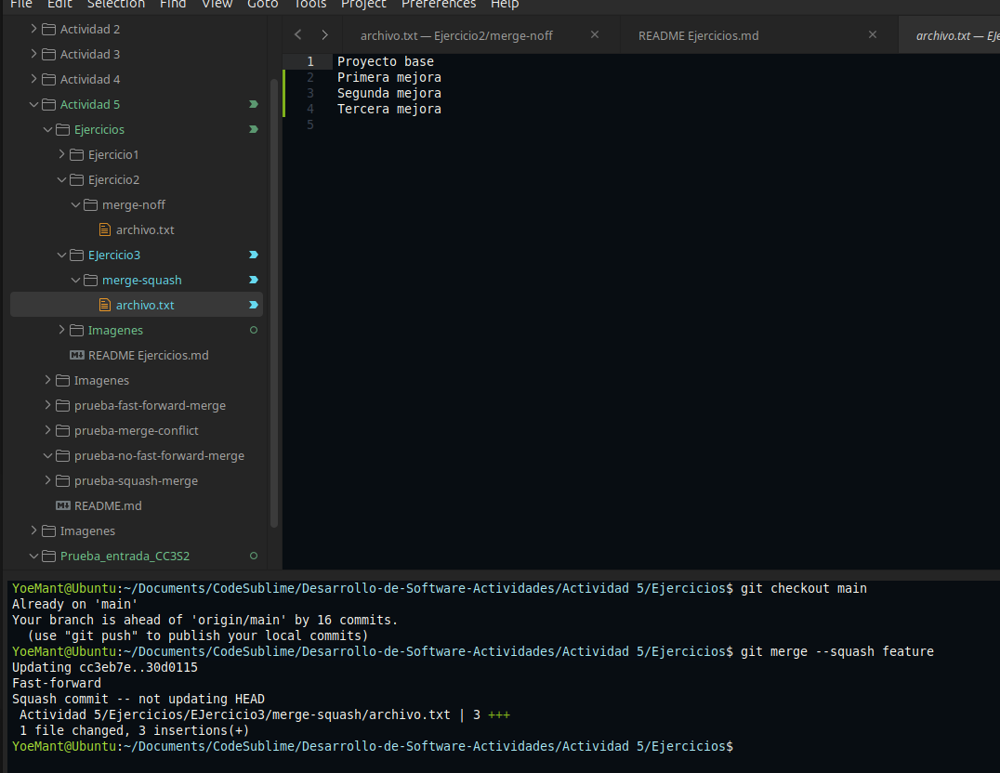
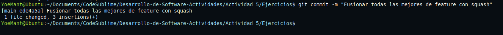
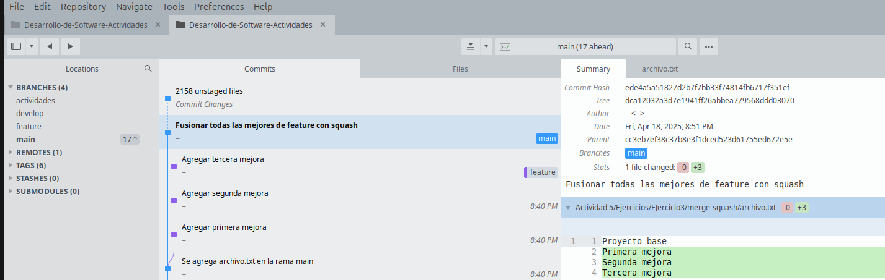
1. **Inicialización del repositorio**  
   Se creó un nuevo repositorio local llamado `merge-squash` e inició con un archivo `archivo.txt` que fue registrado con un commit inicial en la rama `main`.

2. **Creación de la rama `feature`**  
   Desde la rama principal, se creó una nueva rama `feature` para desarrollar mejoras al archivo existente.

3. **Múltiples commits en la rama `feature`**  
   En `feature`, se realizaron tres mejoras diferentes al archivo `archivo.txt` y cada una fue registrada con su propio commit. Esto simula un desarrollo progresivo y detallado de una funcionalidad.

4. **Verificación del historial en `feature`**  
   Al ejecutar `git log --oneline`o este caso al ver Sublime Merge, se observó un historial con tres commits correspondientes a los cambios realizados en la rama `feature`.

5. **Cambio a la rama `main` y fusión con `--squash`**  
   Se volvió a la rama `main` y se utilizó `git merge --squash feature`. Esto combinó todos los cambios de la rama `feature` en un solo bloque de cambios pendientes, **sin traer los commits individuales**.

6. **Commit final unificado**  
   Se realizó un único commit en `main` que integró todas las mejoras de `feature` en una sola entrada del historial, con un mensaje personalizado.

7. **Verificación del historial en `main`**  
   Al revisar el historial con `git log --graph --oneline` o con Sublime Merge, se observó solo un commit que representa la integración, lo que **aplasta** los commits de la rama `feature` y deja el historial limpio.

8. **Eliminación de la rama `feature`**  
   Como los cambios ya fueron integrados en `main`, se eliminó la rama `feature` usando `git branch -d feature`
   de esta manera se limpia el repositorio.

---

### Ejercicio: Comparar los historiales con git log después de diferentes fusiones
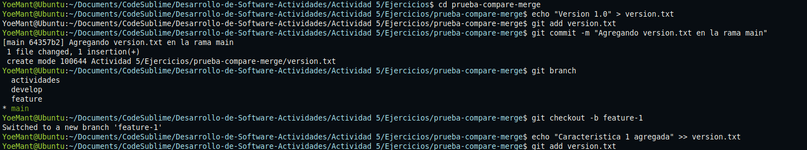
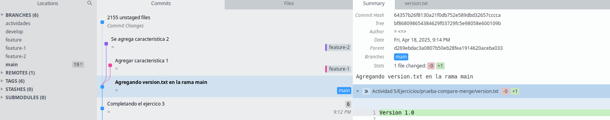
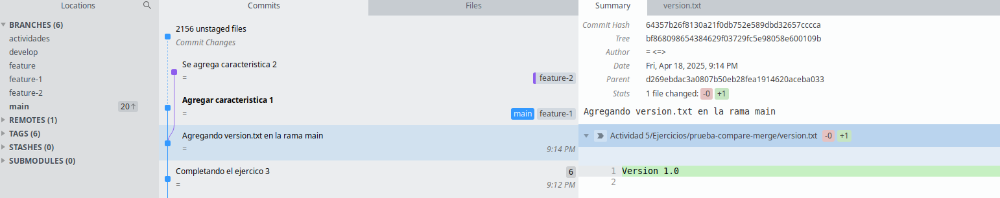
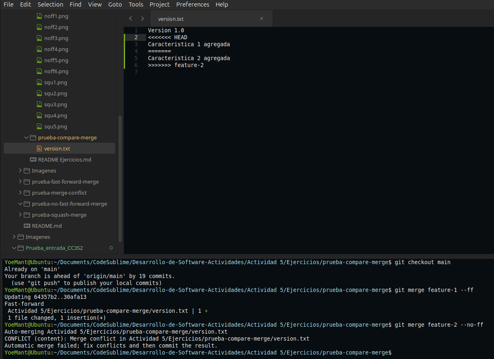
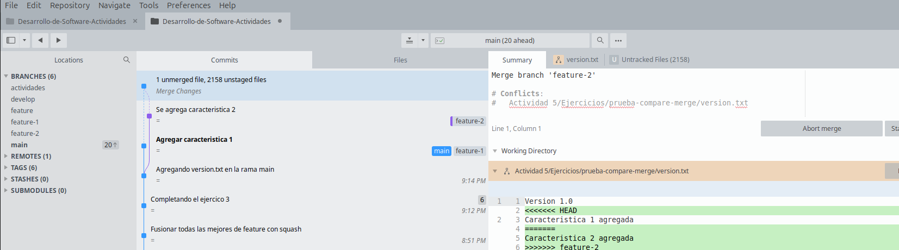
[Descripción](Imagenes/cm6.png)
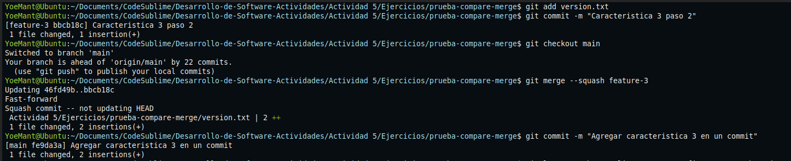
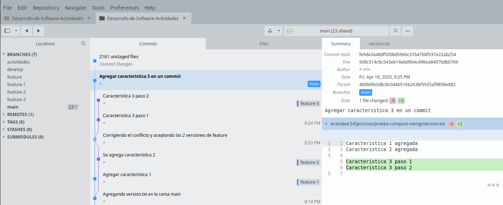

1. **Inicio del proyecto**  
   Se creó el repositorio `prueba-compare-merge` y se registró un commit inicial con el archivo `version.txt` indicando la versión 1.0.

2. **Rama `feature-1` y fusión fast-forward**  
   En `feature-1` se añadió una característica y luego se fusionó con `main` usando `git merge --ff`.  
   Esto **avanzó directamente el puntero de `main`** al commit de `feature-1`, sin crear un commit de fusión.

3. **Rama `feature-2` y fusión con conflicto (`--no-ff`)**  
   En `feature-2` se agregó otra línea al mismo archivo. Al intentar fusionarla con `main` usando `git merge --no-ff`, **se produjo un conflicto** porque `version.txt` fue modificado en la misma zona por ambas ramas.  
   El conflicto fue **resuelto manualmente aceptando ambas versiones**, y se realizó el commit con el mensaje:  
   `"Corrigiendo el conflicto y aceptando las 2 versiones de feature"`.

4. **Rama `feature-3` y fusión con squash**  
   Se creó la rama `feature-3` y se hicieron **dos commits separados** (paso 1 y paso 2).  
   Luego se fusionó con `main` usando `git merge --squash`.  
   Esto combinó los dos commits **en un solo conjunto de cambios**, y se hizo un solo commit en `main` con el mensaje:  
   `"Agregar caracteristica 3 en un commit"`.
