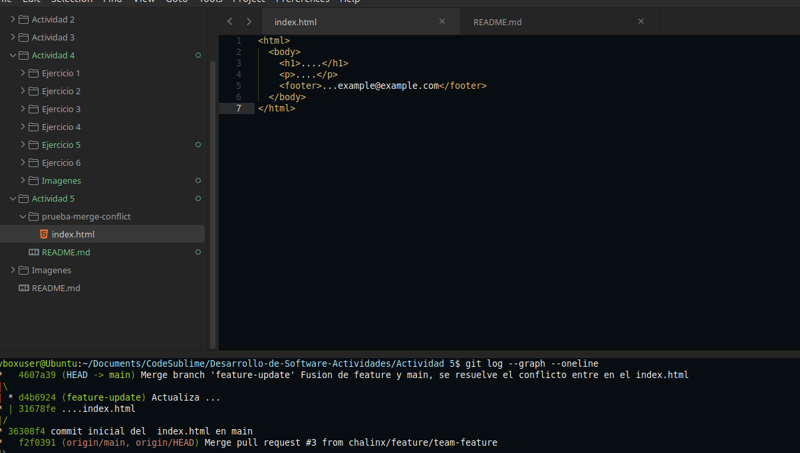
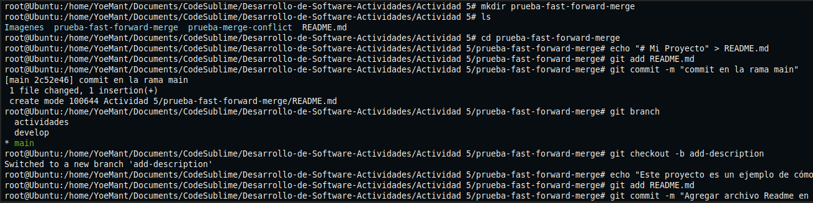
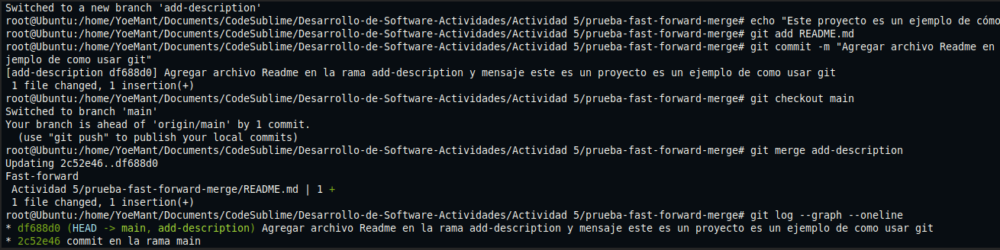
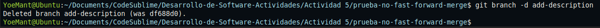
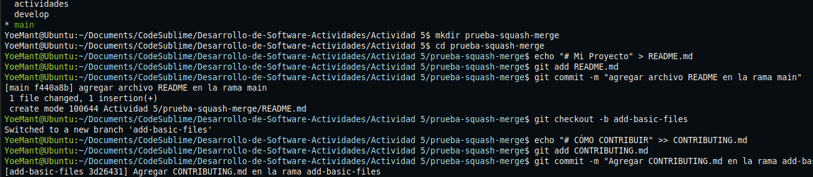
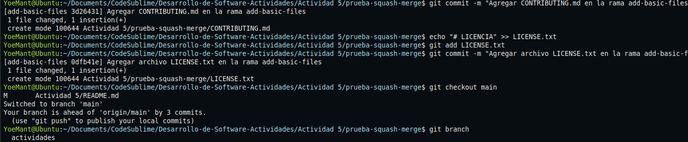

### Resolver conflictos en una fusión non-fast-forward

1. Se crea una nueva carpeta non-fast-forward.

2. Se crea un archivo llamado `index.html` con contenido y se hace un commit en la rama principal `main`.

3. Luego, se crea una nueva rama llamada `feature-update` donde se edita el archivo `index.html` agregando un párrafo y se guarda ese cambio con un commit.

4. Después se regresa a la rama `main` y se hace otra modificación al mismo archivo, esta vez añadiendo un pie de página y se guarda también con otro commit.

5. Al intentar fusionar la rama `feature-update` con la rama `main` usando `git merge --no-ff` Git detecta un conflicto porque ambos cambios se hicieron en el mismo archivo.

6. Se abre el archivo `index.html` y se eliminan las marcas de conflicto. Luego, se combinan los dos cambios manualmente segun nos convenga.

7. Una vez resuelto el conflicto, se guarda el archivo corregido y se agrega al control de cambios y se finaliza la fusión con un commit.

8. Finalmente, se revisa el historial de commits para confirmar que la fusión se realizó correctamente y que se resolvió el conflicto.

---

### Preguntas:

**¿Qué pasos adicionales tomaste para resolver el conflicto?**  
Fue necesario abrir el archivo con conflicto para entender las diferencias entre ambas ramas y asi eliminar las marcas automáticas de Git, se combinar manualmente los cambios y luego hacer un commit adicional para completar el merge.

**¿Qué estrategias pueden ayudarte a evitar conflictos en el futuro?**  
Algunas estrategias son mantener una buena comunicación entre los miembros del equipo o actualizar frecuentemente la rama local con los últimos cambios del repositorio remoto y asi evitar trabajar varios en el mismo archivo o en la misma parte del archivo, y tambien hacer commits pequeños y frecuentes para facilitar el proceso.

## Fusión Fast-forward:

1. **Creación de la carpeta de trabajo**  
   Se creó una nueva carpeta llamada `prueba-fast-forward-merge` dentro de la actividad 5 para realizar las pruebas de fusión.

2. **Creación del archivo inicial**  
   Se creó un archivo `README.md` con el título del proyecto, y se preparó para el seguimiento de cambios (staging).

3. **Primer commit en la rama principal (`main`)**  
   Se guardó el archivo `README.md` con un commit inicial en la rama principal, lo que marca el punto de partida del proyecto.

4. **Verificación de ramas existentes**  
   Se listaron las ramas, confirmando que se trabaja en la rama `main`.

5. **Creación de una nueva rama (`add-description`)**  
   Se creó una nueva rama de desarrollo a partir del estado actual de `main`, donde se realizarán nuevas modificaciones.

6. **Modificación del archivo en la nueva rama**  
   Se añadió una línea descriptiva al archivo `README.md`, indicando que es un ejemplo práctico sobre Git.

7. **Commit en la rama `add-description`**  
   Se guardaron los cambios realizados con un nuevo commit en la rama secundaria.

8. **Regreso a la rama principal (`main`)**  
   Se volvió a `main` para integrar los cambios de la rama `add-description`.

9. **Fusión fast-forward**  
    Como `main` no tuvo cambios desde la creación de `add-description`, Git aplicó una fusión fast-forward. Esto significa que el historial de `main` avanzó directamente al último commit de `add-description`, sin necesidad de crear un commit de fusión.

10. **Visualización del historial**  
    Al revisar el historial de commits con un grafo, se observa una línea recta de commits, mostrando que el historial es completamente lineal y sin bifurcaciones.

11. **Eliminación de la rama add-description**
	Tras completar la fusión se eliminó la rama add-description al no ser necesaria, ya que sus cambios fueron integrados en main

## Fusión tipo squash

1. **Creación del entorno de trabajo**  
   Se creó la carpeta `prueba-squash-merge`.

2. **Commit inicial en la rama principal**  
   Se creó el archivo `README.md` con información básica del proyecto y se guardó con un primer commit en la rama `main`.

3. **Creación de la rama `add-basic-files`**  
   Desde `main` se creó una nueva rama para trabajar en archivos básicos del repositorio.

4. **Creación y commit de `CONTRIBUTING.md`**  
   Se añadió el archivo `CONTRIBUTING.md` con una sección de contribución, guardándolo en un nuevo commit.

5. **Creación y commit de `LICENSE.txt`**  
   Se agregó también un archivo de licencia y se registró con otro commit adicional.

6. **Retorno a la rama `main`**  
   Se cambió nuevamente a la rama principal para integrar los cambios hechos en `add-basic-files`.

7. **Fusión tipo squash**  
   Se utilizó `git merge --squash` para combinar todos los commits de `add-basic-files` en un solo conjunto de cambios listos para ser comiteados. Esto permite integrar el trabajo en `main` con un único commit, limpiando el historial.

8. **Eliminación de la rama `add-basic-files`**  
   Una vez aplicada la fusión squash, se eliminó la rama `add-basic-files` porque ya no era necesaria, y sus cambios fueron incorporados en `main`.

---

