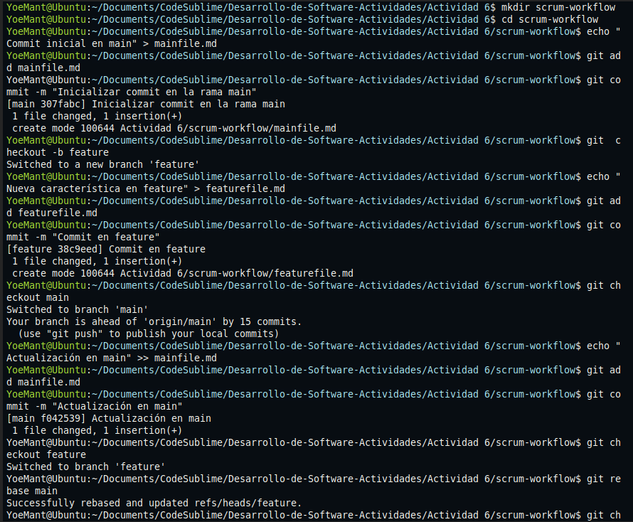
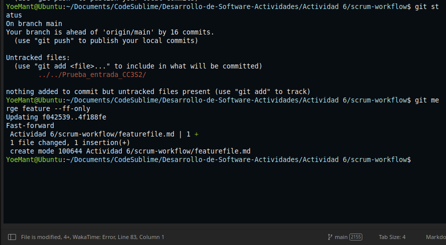
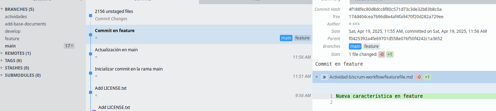

# Ejercicio de Rebase

## Pregunta: Presenta el historial de ramas obtenida hasta el momento.

## Tu gráfico de commits ahora diverge (comprueba esto)

## Revisión:

Después de realizar el rebase, visualiza el historial de commits con:
`$ git log --graph –oneline`

## Momento de fusionar y completar el proceso de git rebase:

# Ejercicio de `Cherry-Pick`

### Pregunta: Muestra un diagrama de como se ven las ramas en este paso.

### Revisa el historial nuevamente:

## Preguntas de discusión:

1. ### ¿Por qué `rebase` ayuda a mantener un historial más lineal que merge?

	Porque `rebase` mueve los commits de una rama sobre otra como si se hubieran creado allí sin crear un commit de fusión, esto mantiene el historial más limpio y lineal, 	evitando ramas paralelas y commits de merge innecesarios.

2. ### ¿Qué problemas pueden surgir al hacer `rebase` en ramas compartidas?

	Cambia el historial de commits, lo que puede causar conflictos o errores a otros colaboradores que ya clonaron o hicieron pull.
	Cuando haces `push` después de un rebase, debes forzar (`--force`), lo que puede sobrescribir el trabajo de otros.

3. ### ¿Diferencia entre `cherry-pick` y `merge`, y cuándo usar cada uno?

	`merge` une dos ramas completas manteniendo el historial de ambas mientras `cherry-pick` copia solo un commit específico de otra rama.
	Y `merge` si necesitas integrar todo el trabajo de una rama mientas `cherry-pick` si solo necesitas uno o pocos commits, sin traer toda la rama.  

4. ### ¿Por qué evitar `rebase` en ramas públicas?

	Porque al hacer `rebase`los commits cambian osea tienen otro hash, si otros ya trabajan esa rama sus historiales ya no coincidirán lo que causa conflictos.

___
## Ejercicios teóricos

1. ### Diferencias entre `git merge` y `git rebase`

	En `git merge` combina ramas manteniendo su historial y crea un commit de fusión dando esto utilidad para mantener trazabilidad en equipos Scrum al integrar historias completas, mientras `git rebase` reescribe el historial colocando los commits encima de otra rama, dejando el historial más limpio y lineal ideal para uso individual durante el desarrollo antes del merge final.

2. ### Relación entre `git rebase` y DevOps

	En `git rebase` ayuda a DevOps porque mantiene un historial lineal y limpio lo que facilita la automatización de pipelines y la integración continua, donde un historial lineal simplifica las revisiones de código y mejora la entrega continua en entornos CI/CD.
	

3. ### Impacto de `git cherry-pick` en un equipo Scrum

	En `git cherry-pick` permite aplicar solo los commits necesarios a producción, sin fusionar toda la rama. Es útil si solo algunos cambios del Sprint están listos ademas que ayuda a entregar valor puntual, aunque puede generar conflictos si los commits están relacionados o se duplican luego al hacer merge.

## Ejercicios prácticos

### Simulación de un flujo de trabajo Scrum con git rebase y git merge
 

1. **Creación del proyecto local**
   Se crea la carpeta `scrum-workflow`.
   Se inicializa el archivo `mainfile.md` con el contenido `"Commit inicial en main"`.

2. **Primer commit en la rama `main`**
   Se agrega y se realiza el commit inicial: `"Inicializar commit en la rama main"`.

3. **Creación de la rama `feature`**
   Se crea y cambia a la rama `feature` usando `git checkout -b`.

4. **Desarrollo de una nueva funcionalidad**
   Se crea el archivo `featurefile.md` con contenido.
   Se hace un commit: `"Commit en feature"`.

5. **Se continúa el trabajo en `main`**
   Se regresa a `main` y se actualiza `mainfile.md`.
   Se realiza el commit: `"Actualización en main"`.

6. **Rebase de `feature` sobre `main`**
   Se cambia a `feature` y se ejecuta `git rebase main`.
   Esto reubica el commit de `feature` encima del commit más reciente de `main`, manteniendo un historial lineal.

7. **Fusión final de `feature` en `main` con fast-forward**
   Se regresa a `main` y se ejecuta `git merge feature --ff-only`.
   Al estar rebaseada, Git permite una fusión limpia y directa sin crear un commit de merge.

---
### Preguntas:
#### ¿Qué sucede con el historial de commits después del `rebase`?

Después de un `git rebase` los commits de la rama actual se reubican encima del último commit de la rama base.
Esto genera nuevos commits con nuevos identificadores hash, lo que da como resultado un historial lineal y más limpio, sin commits de fusión.

#### ¿En qué situación aplicarías una fusión fast-forward en un proyecto ágil?

En la rama que trabaja con `main` y está actualizada, donde 
no hay commits nuevos en `main` desde que se creó la rama. Entonces al querer integrar cambios sin generar un commit de merge, se mantiene el historial simple.
Esto es ideal para equipos ágiles cuando la historia está terminada y lista para integrarse sin conflictos ni ramas paralelas.
