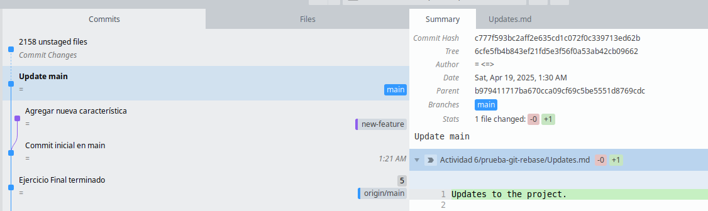
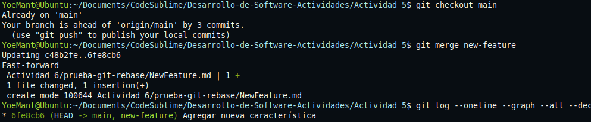

# Ejercicio de Rebase

## Pregunta: Presenta el historial de ramas obtenida hasta el momento.

## Tu gráfico de commits ahora diverge (comprueba esto)

## Revisión:

Después de realizar el rebase, visualiza el historial de commits con:
`$ git log --graph –oneline`

## Momento de fusionar y completar el proceso de git rebase:

# Ejercicio de `Cherry-Pick`

### Pregunta: Muestra un diagrama de como se ven las ramas en este paso.

### Revisa el historial nuevamente:

1. ### ¿Por qué `rebase` ayuda a mantener un historial más lineal que merge?

	Porque `rebase` mueve los commits de una rama sobre otra como si se hubieran creado allí sin crear un commit de fusión, esto mantiene el historial más limpio y lineal, 	evitando ramas paralelas y commits de merge innecesarios.

2. ### ¿Qué problemas pueden surgir al hacer `rebase` en ramas compartidas?

	Cambia el historial de commits, lo que puede causar conflictos o errores a otros colaboradores que ya clonaron o hicieron pull.
	Cuando haces `push` después de un rebase, debes forzar (`--force`), lo que puede sobrescribir el trabajo de otros.

3. ### ¿Diferencia entre `cherry-pick` y `merge`, y cuándo usar cada uno?

	`merge` une dos ramas completas manteniendo el historial de ambas mientras `cherry-pick` copia solo un commit específico de otra rama.
	Y `merge` si necesitas integrar todo el trabajo de una rama mientas `cherry-pick` si solo necesitas uno o pocos commits, sin traer toda la rama.  

4. ### ¿Por qué evitar `rebase` en ramas públicas?

	Porque al hacer `rebase`los commits cambian osea tienen otro hash, si otros ya trabajan esa rama sus historiales ya no coincidirán lo que causa conflictos.
