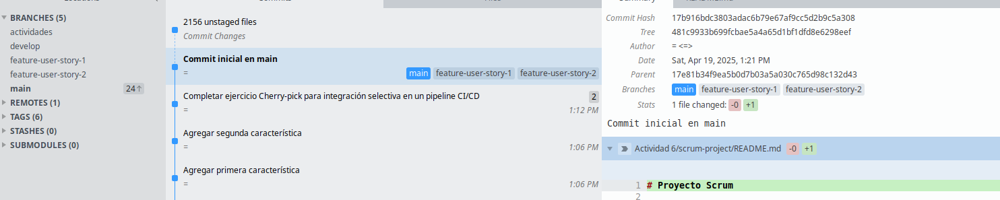
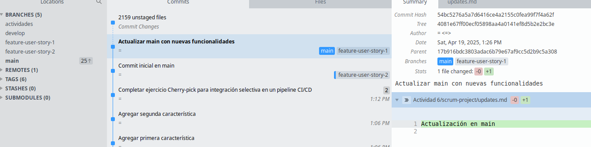

# Ejercicio de Rebase

## Pregunta: Presenta el historial de ramas obtenida hasta el momento.


## Tu gráfico de commits ahora diverge (comprueba esto)


## Revisión:

Después de realizar el rebase, visualiza el historial de commits con:
`$ git log --graph –oneline`


## Momento de fusionar y completar el proceso de git rebase:


# Ejercicio de `Cherry-Pick`

### Pregunta: Muestra un diagrama de como se ven las ramas en este paso.


### Revisa el historial nuevamente:


## Preguntas de discusión:

1. ### ¿Por qué `rebase` ayuda a mantener un historial más lineal que merge?

	Porque `rebase` mueve los commits de una rama sobre otra como si se hubieran creado allí sin crear un commit de fusión, esto mantiene el historial más limpio y lineal, 	evitando ramas paralelas y commits de merge innecesarios.


2. ### ¿Qué problemas pueden surgir al hacer `rebase` en ramas compartidas?

	Cambia el historial de commits, lo que puede causar conflictos o errores a otros colaboradores que ya clonaron o hicieron pull.
	Cuando haces `push` después de un rebase, debes forzar (`--force`), lo que puede sobrescribir el trabajo de otros.


3. ### ¿Diferencia entre `cherry-pick` y `merge`, y cuándo usar cada uno?

	`merge` une dos ramas completas manteniendo el historial de ambas mientras `cherry-pick` copia solo un commit específico de otra rama.
	Y `merge` si necesitas integrar todo el trabajo de una rama mientas `cherry-pick` si solo necesitas uno o pocos commits, sin traer toda la rama.  


4. ### ¿Por qué evitar `rebase` en ramas públicas?

	Porque al hacer `rebase`los commits cambian osea tienen otro hash, si otros ya trabajan esa rama sus historiales ya no coincidirán lo que causa conflictos.

___
## Ejercicios teóricos

1. ### Diferencias entre `git merge` y `git rebase`

	En `git merge` combina ramas manteniendo su historial y crea un commit de fusión dando esto utilidad para mantener trazabilidad en equipos Scrum al integrar historias completas, mientras `git rebase` reescribe el historial colocando los commits encima de otra rama, dejando el historial más limpio y lineal ideal para uso individual durante el desarrollo antes del merge final.


2. ### Relación entre `git rebase` y DevOps

	En `git rebase` ayuda a DevOps porque mantiene un historial lineal y limpio lo que facilita la automatización de pipelines y la integración continua, donde un historial lineal simplifica las revisiones de código y mejora la entrega continua en entornos CI/CD.
	

3. ### Impacto de `git cherry-pick` en un equipo Scrum

	En `git cherry-pick` permite aplicar solo los commits necesarios a producción, sin fusionar toda la rama. Es útil si solo algunos cambios del Sprint están listos ademas que ayuda a entregar valor puntual, aunque puede generar conflictos si los commits están relacionados o se duplican luego al hacer merge.

## Ejercicios prácticos

### Simulación de un flujo de trabajo Scrum con git rebase y git merge
 


1. **Creación del proyecto local**
   Se crea la carpeta `scrum-workflow`.
   Se inicializa el archivo `mainfile.md` con el contenido `"Commit inicial en main"`.

2. **Primer commit en la rama `main`**
   Se agrega y se realiza el commit inicial: `"Inicializar commit en la rama main"`.

3. **Creación de la rama `feature`**
   Se crea y cambia a la rama `feature` usando `git checkout -b`.

4. **Desarrollo de una nueva funcionalidad**
   Se crea el archivo `featurefile.md` con contenido.
   Se hace un commit: `"Commit en feature"`.

5. **Se continúa el trabajo en `main`**
   Se regresa a `main` y se actualiza `mainfile.md`.
   Se realiza el commit: `"Actualización en main"`.

6. **Rebase de `feature` sobre `main`**
   Se cambia a `feature` y se ejecuta `git rebase main`.
   Esto reubica el commit de `feature` encima del commit más reciente de `main`, manteniendo un historial lineal.

7. **Fusión final de `feature` en `main` con fast-forward**
   Se regresa a `main` y se ejecuta `git merge feature --ff-only`.
   Al estar rebaseada, Git permite una fusión limpia y directa sin crear un commit de merge.

---
### Preguntas:
#### ¿Qué sucede con el historial de commits después del `rebase`?

Después de un `git rebase` los commits de la rama actual se reubican encima del último commit de la rama base.
Esto genera nuevos commits con nuevos identificadores hash, lo que da como resultado un historial lineal y más limpio, sin commits de fusión.


#### ¿En qué situación aplicarías una fusión fast-forward en un proyecto ágil?


En la rama que trabaja con `main` y está actualizada, donde 
no hay commits nuevos en `main` desde que se creó la rama. Entonces al querer integrar cambios sin generar un commit de merge, se mantiene el historial simple.
Esto es ideal para equipos ágiles cuando la historia está terminada y lista para integrarse sin conflictos ni ramas paralelas.

## Cherry-pick para integración selectiva en un pipeline CI/CD


### ¿Cómo utilizarías `cherry-pick` en un pipeline de CI/CD?

Usaría `git cherry-pick` para seleccionar y aplicar solo los commits que están listos y aprobados desde una rama de desarrollo o funcionalidad hacia la rama de producción (`main` o `release`).  
Esto permite desplegar cambios puntuales sin necesidad de fusionar toda la rama.

### ¿Qué ventajas ofrece `cherry-pick` en un flujo DevOps?

Permite mover solo los commits necesarios, sin arrastrar otros no deseados. Facilita hotfixes o actualizaciones rápidas sin esperar un merge completo. Ideal en entornos donde los ciclos de desarrollo y despliegue están desacoplados. Permite evitar conflictos o cambios inestables al mantener ramas separadas.

---

## Git, Scrum y Sprints

### Fase 1: Planificación del sprint (sprint planning)
### Ejercicio 1: Crear ramas de funcionalidades (feature branches)




#### Pregunta: ¿Por qué es importante trabajar en ramas de funcionalidades separadas durante un sprint?
Trabajar en ramas de funcionalidades separadas durante un sprint es importante porque permite aislar los cambios de cada historia de usuario, evitando que interfieran entre sí. Esto facilita el trabajo en paralelo del equipo, mejora la organización, y permite probar y revisar cada funcionalidad por separado. Además, ayuda a mantener la rama principal `main`limpia y estable ya que solo se integran los cambios que están completos y verificados. De esta forma, se asegura una mejor calidad del código y una integración más controlada al final del sprint.

### Fase 2: Desarrollo del sprint (sprint execution)
### Ejercicio 2: Integración continua con git rebase





#### pregunta: ¿Qué ventajas proporciona el rebase durante el desarrollo de un sprint en términos de integración continua?

El uso de `rebase` durante el desarrollo de un sprint proporciona ventajas importantes para la integración continua, esto permite mantener un historial limpio y lineal lo cual facilita el seguimiento de los cambios y mejora la claridad del repositorio. Al aplicar rebase los desarrolladores actualizan sus ramas con los últimos cambios de la rama principal lo cual reduce la posibilidad de conflictos al momento de integrar el código. Además al tener un historial más ordenado se simplifica el trabajo de los sistemas de integración continua, ya que pueden identificar, probar y desplegar los cambios de manera más eficiente y segura.

### Fase 3: Revisión del sprint (sprint review)
### Ejercicio 3: Integración selectiva con git cherry-pick


#### Pregunta: ¿Cómo ayuda git cherry-pick a mostrar avances de forma selectiva en un sprint review?

Al usar`git cherry-pick` ayuda a mostrar avances de forma selectiva en un sprint review porque permite traer únicamente los commits de funcionalidades que ya están completas y listas para demostración sin necesidad de fusionar toda la rama de trabajo. Esto es útil cuando una historia de usuario tiene partes terminadas y otras aún en progreso ya que se puede integrar solo lo necesario para mostrar el avance real manteniendo asi el control sobre qué cambios se presentan y evitando mostrar código incompleto o no probado.


### Fase 4: Retrospectiva del sprint (sprint retrospective)
### Ejercicio 4: Revisión de conflictos y resolución


#### Pregunta: ¿Cómo manejas los conflictos de fusión al final de un sprint?
Para manejar los conflictos de fusión al final de un sprint es importante identificar y resolver los archivos en conflicto de forma inmediata, revisar de manera cuidadosa los cambios de cada rama y eligiendo cual conservar. 

#### Cómo puede el equipo mejorar la comunicación para evitar conflictos grandes?
Para evitar conflictos grandes el equipo puede mejorar la comunicación manteniendo actualizadas sus ramas mediante pull y rebase frecuentes revisando qué otras historias están tocando los mismos archivos y acordando buenas prácticas de codificación. 

### Fase 5: Fase de desarrollo, automatización de integración continua (CI) con git rebase
### Ejercicio 5: Automatización de rebase con hooks de Git


#### Pregunta: ¿Qué ventajas y desventajas observas al automatizar el rebase en un entorno de CI/CD?


### **Ventaja:**

Automatizar el `rebase` permite mantener un historial limpio y ordenado en el repositorio. Esto facilita la lectura, revisión del código y depuración durante la integración continua.


### **Desventaja:**

Si se aplica `rebase` en ramas compartidas por varios desarrolladores, puede causar conflictos o sobrescribir cambios, lo que complica la colaboración y puede generar errores difíciles de rastrear.

### Ejemplo:
### Inicialización del proyecto y creación de ramas
### Documentación y reflexión


1. **Inicialización del proyecto colaborativo**
	Se crea una carpeta llamada `proyecto-colaborativo`despues se agrega un archivo `archivo_colaborativo.txt` con contenido base y hacemos un commit inicial en la rama `main`.


2. **Creación y trabajo en una rama de funcionalidad**
	Se crea y cambia a la rama `feature-branch`, modificamos el archivo agregando una línea y hacemos un commit con los cambios en la rama `feature-branch`.


3. **Cambios paralelos en `main`**
	Se vuelve a la rama `main` y también se modifica el mismo archivo,hacemos un commit llamado `"Cambios en main"`.


4. **Fusión con conflicto**
	Al intentar fusionar `feature-branch` con `main`, Git detecta un conflicto de contenidoen el mismo archivo. 
	Se resuelve el conflicto manualmente y se hace un commit indicando que se aceptaron ambas versiones.


5. **Se revierte ese último commit**
	Se utiliza `git reset --soft HEAD~1` para deshacer el último commit pero mantener los cambios.
	Deshacemos el `add` con `git restore --staged`.
	Se usa `git checkout --ours` para conservar la versión de `main`y despues se vuelve a agregar el archivo y se hace un nuevo commit indicando que se resolvió el conflicto.


6. **Simulación de conflicto nuevamente**
	Se intenta una fusión con `--no-ff` y `--no-commit`, que 	vuelve a causar un conflicto, visualizamos el conflicto con `git diff --cached`.
	Se cancela el merge con `git merge --abort`.


7. **Verificación del historial y creación de etiqueta**
	Se revisa el historial con `git log`, hacemos un `git revert`para deshacer el commit "Cambios en main",creamos una etiqueta `v1.0.0` indicando una versión estable del proyecto y por ultimo se hace push de esa etiqueta al repositorio remoto en GitHub.


8. **Inicio de búsqueda de error con `git bisect`**
	Se comienza el proceso con `git bisect start`.
	ademas se indica que el commit actual es malo`git bisect bad`ademas marcamos un commit anterior como bueno `git bisect good` Git encuentra el commit problemático en este caso, el commitbase y por ultimo salimos del modo bisect con `git bisect reset`.

#### Reflexión
En un flujo de trabajo DevOps los comandos de Git permiten gestionar versiones, integrar cambios de forma controlada, revertir errores sin afectar el historial y automatizar despliegues. Herramientas como merge, rebase, revert, tag y bisect ayudan a mantener un código limpio, estable y colaborativo, optimizando la entrega continua y facilitando la detección de errores.

---

## Preguntas

1. **Ejercicio para `git checkout --ours` y `git checkout --theirs`**

	- **¿Cómo utilizarías los comandos git checkout --ours y git checkout --theirs para resolver este conflicto de manera rápida y eficiente?**  
		Usar `git checkout --ours archivo` si quieres conservar los cambios de la rama actual, pero si se quiere los cambios de la rama que se está fusionando entonces `git checkout --theirs archivo`
	
	- **Explica cuándo preferirías usar cada uno de estos comandos y cómo impacta en la pipeline de CI/CD.**  
		Se usaria `--ours` si está en su rama y quiere conservar su versión, en cambio si se quiere usar`--theirs` es si está fusionando y desea los cambios entrantes.
	
	- **¿Cómo te asegurarías de que la resolución elegida no comprometa la calidad del código?**  
		Creo que resolver rápido evita detener la pipeline, esto asegurar la calidad requiere probar los cambios localmente y pasar por validaciones automáticas.


2. **Ejercicio para `git diff`**

	- **Utilizando el comando git diff,¿cómo compararías los cambios entre ramas para identificar diferencias específicas en archivos críticos?**  
		Ejecutariamos  `git diff feature-branch..main` para comparar ramas, de esta manera se detecta diferencias en archivos críticos antes de hacer merge.
	- **¿Cómo podrías utilizar git diff feature-branch..main para detectar posibles conflictos antes de una fusión?**
		El comando git diff `feature-branch..main` muestra todas las diferencias entre las dos ramas, ya que si un archivo ha sido modificado en ambas y especialmente en las mismas líneas, hay alta probabilidad de conflicto.
	- **¿Cómo contribuye esto a mantener la estabilidad en un entorno ágil con CI/CD?**
		Detectar diferencias y posibles conflictos con git diff antes del merge ayuda a:
			-Evitar errores en la integración continua (CI).
			-Reducir interrupciones en los despliegues automáticos (CD).	
			-Asegurar que las ramas se integren de forma controlada, 	manteniendo la calidad y estabilidad del repositorio.


---

3. **`git merge --no-commit --no-ff`**

	- **Describe cómo usarías el comando git merge --no-commit --no-ff para simular una fusión en tu rama local.**  
		Permite probar una fusión sin hacer el commit inmediatamente, ademas es ideal para revisar si habrá conflictos antes de integrar.
	
	- **Qué ventajas tiene esta práctica en un flujo de trabajo ágil con CI/CD, y cómo ayuda a minimizar errores antes de hacer commits definitivos?**  
		La principal ventaja es que permite anticiparse a conflictos y errores antes de que se comprometan cambios definitivos, esto en un entorno ágil con CI/CD reduce el riesgo de fallos en la integración continua y evita romper la pipeline. 
	
	- **¿Cómo automatizarías este paso dentro de una pipeline CI/CD?**
		Automatizaría esta validación creando un paso dentro del pipeline para que realice una fusión simulada entre ramas sin confirmar los cambios, despues se ejecutarían pruebas y validaciones. Si todo es correcto el pipeline puede continuar, pero si hay errores entonces cancela la integración, de esta manera ayuda a mantener la calidad del código y evitar introducir problemas.

4. **Ejercicio para `git mergetoo`**

	- **Explica cómo configurarías y utilizarías git mergetool en tu equipo para integrar herramientas gráficas que faciliten la resolución de conflictos**  
		Primero configuraria la herramienta con `git config --global merge.tool code`, despues con `git mergetool` para abrir interfaz visual al haber conflictos, entonces nua vez configurado cuando haya conflicto podra ser rasteado por los desarrolladores.
	
	- **¿Qué impacto tiene el uso de git mergetool en un entorno de trabajo ágil con CI/CD, y cómo aseguras que todos los miembros del equipo mantengan consistencia en las resoluciones?**  
		Permite que varios desarrolladores resuelvan conflictos de forma visual y consistente. Aumenta la calidad del merge y evita errores manuales.

---

5. **Ejercicio para`git reset`**

	- **Explica las diferencias entre git reset --soft, git reset --mixed y git reset --hard**
		- `--soft`: deshace el commit, mantiene staging y cambios.
		- `--mixed`: deshace el commit y staging, conserva los cambios.
		- `--hard`: borra todo, incluidos cambios locales.
	
	- **En qué escenarios de un flujo ágil con CI/CD utilizarías cada uno?**
		- `--soft`: cuando solo se quiere modificar el mensaje de 	commit o agrupar varios cambios en uno nuevo, sin perder el 	estado actual.
		- `--mixed`: se es útil cuando se quiere editar cambios antes 	de volver a hacer commit.
		- `--hard`: solo debería usarse cuando estás completamente 	seguro de que puedes descartar los cambios.


6. **Ejercicio para `git revert`**

	- **¿Cómo utilizarías `git revert` para deshacer cambios sin modificar el historial de commits?**  
		`git revert` crea un nuevo commit que invierte los cambios realizados por uno o más commits anteriores, ademas esto lo hace ideal para revertir cambios ya desplegados en producción.
	
	- **¿Cómo aseguras que esta acción no afecte la pipeline de CI/CD y permita una rápida recuperación?.**  
		Antes de hacer git revert me aseguraría de que el commit esté bien testeado localmente o en un entorno de staging,  luego al hacer git revert ejecuto los tests y validaciones en la pipeline, como revert solo añade un nuevo commit la pipeline lo detectará y lo procesará normalmente lo cual permitira restaurar la estabilidad sin interrupciones ni reescritura de historial.


7. **Ejercicio para git stash**

	- **Explica cómo utilizarías `git stash` para guardar temporalmente tus cambios y volver a ellos después de haber terminado el hotfix.**
	Cuando tienes cambios en progreso que aún no deseas commitear pero necesitas cambiar de rama urgentemente, puedes usar `git stash`esto guarda todos los cambios, luego puedes cambiar de rama `hotfix` para trabajar en la corrección y ya después recuperar los cambios guardados con 
	`git stash apply`

	- **¿Qué impacto tiene git stash en un flujo de trabajo ágil con CI/CD cuando trabajas en múltiples tareas?**
	El uso de `git stash` permite una interrupción ordenada del flujo de trabajo sin perder el progreso actual. Esto es crucial en entornos ágiles donde los cambios deben realizarse rápidamente sin comprometer el trabajo en curso.

8. **Ejercicio para `.gitignore`**

	- **Diseña un archivo .gitignore que excluya archivos innecesarios en un entorno ágil de desarrollo.**
	```
	#.gitignre

	# Logs y temporales
	*.log
	*.tmp
	
	# Archivos del sistema
	.DS_Store
	Thumbs.db
	
	# Entornos virtuales
	venv/
	.env
	
	# Configuraciones personales
	*.code-workspace
	.idea/
	```

	- **Explica por qué es importante mantener este archivo actualizado en un equipo colaborativo que utiliza CI/CD y cómo afecta la calidad y limpieza del código compartido en el repositorio.**  
	Evita que archivos irrelevantes entren al repositorio. Mejora la limpieza del código y previene errores en entornos compartidos y automatizados.

---
