# Actividad 7


## 1. Creación de la estructura del proyecto


La estructura generada del proyecto :

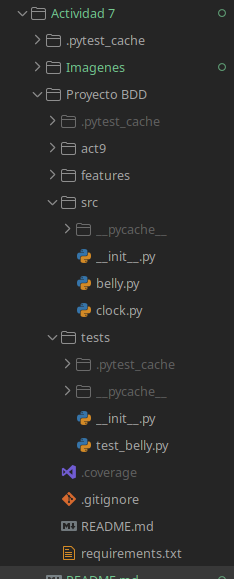

En el archivo `features/belly.feature`, se agrega los escenarios en Gherkin, se utilizaron frases en español para simular acciones.

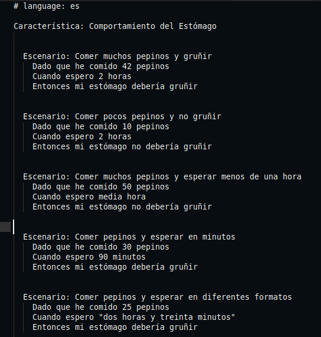

Se creó la clase `Belly`, encargada de manejar la lógica principal que incluye los métodos como `comer`, `esperar` y `esta_gruñendo`.

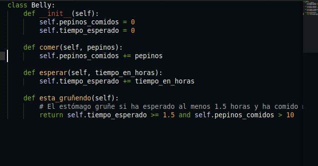


Se agregar el archivo `steps.py` los pasos correspondientes a los escenarios definidos en Gherkin. Cada paso traduce las frases del lenguaje natural a funciones ejecutables. 

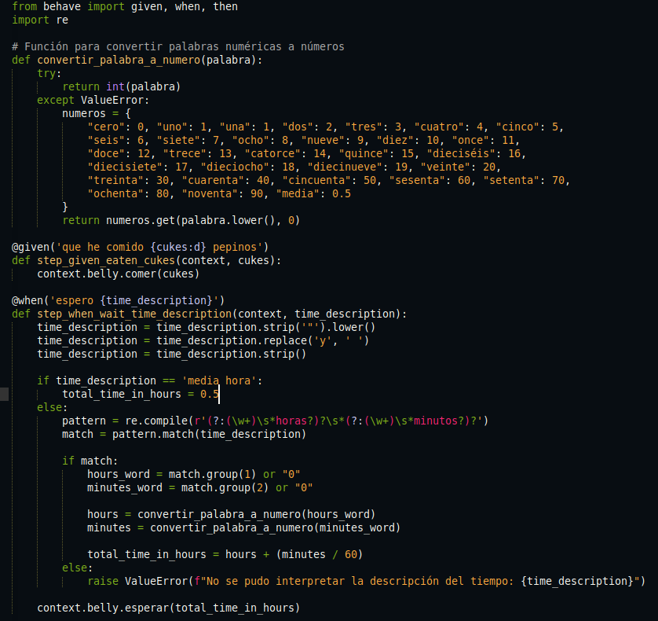

	Se configura este archivo para inicializar una nueva instancia de `Belly` antes de cada escenario, asegurando que cada prueba comience con un estado limpio.
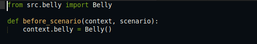


## 2. Ejecución de las pruebas BDD

Una vez implementados los pasos y la lógica se ejecutan las pruebas:


Cada escenario Gherkin prueba si el estómago gruñe o no después de comer cierta cantidad de pepinos y esperar un tiempo. Se validan distintos formatos de tiempo: horas, media hora, minutos y frases completas.


## 3. Creacion del pipeline

## Automatización de pruebas con GitHub Actions

Se configuró un flujo de trabajo automatizado utilizando GitHub Actions el cual se encarga de ejecutar tanto las pruebas unitarias con `pytest` como las pruebas BDD con `behave` de manera automática cada vez que se realiza un `push` o `pull request` en el repositorio.

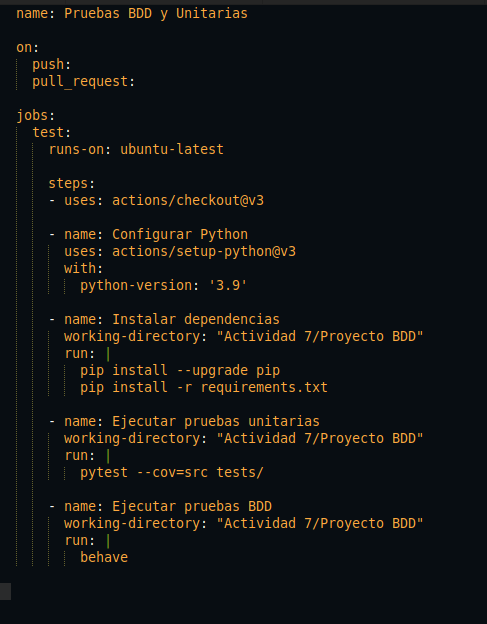

  - **Nombre del workflow**: Pruebas BDD y Unitarias
  - El flujo se ejecuta automaticamente al hacer `push` o `pull request`, lo que verifica en tiempo real que no rompa ninguna prueba.
  - Se crea un `jobs` llamado test para correr un entorno linux con `ubuntu-latest`.
  - `actions/chechout@v3` descarga el contenido del repositorio para trabajar con el.
  - `python-version: '3.9'` Instala y configura la versión 3.9 de Python para el entorno
  - `Instalar dependencias` desde la carpeta de proyectos se instala todas las dependencias del archivo `requeriments.txt`.
  - `Ejecturar pruebas unitarias`se ejecuta las pruebas unitarias usando pytest.
  - `Ejecturar pruebas BDD`Ejecuta las pruebas BDD escritas en Gherkin a través de `behave`.

## Ejercicio 1
### Añadir soporte para minutos y segundos en tiempos de espera

Se agrega nuevo escenario en la prueba.
   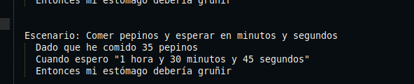

Se modifica `steps.py` la expresion regular para que pueda aceptar segundos 

```python
pattern = re.compile(r'(?:(\w+)\s*horas?)?\s*(?:(\w+)\s*minutos?)?\s*(?:(\w+)\s*segundos?)?')
seconds = convertir_palabra_a_numero(seconds_word)
total_time_in_hours = hours + (minutes / 60) + (seconds / 3600)
```
  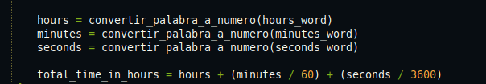

  - Se crea una prueba unitaria que verifique que el estómago gruñe cuando se comen 35 pepinos y se espera exactamente 1 hora, 30 minutos y 45 segundos
  
  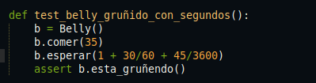

#### Resultados
- Se ejecuta el comando `behave` exitosamente los 6 escenarios, donde cada escenario simula una situación diferente y todos se pasaron,ejecutandose de manera correcta y sin errores.
  
  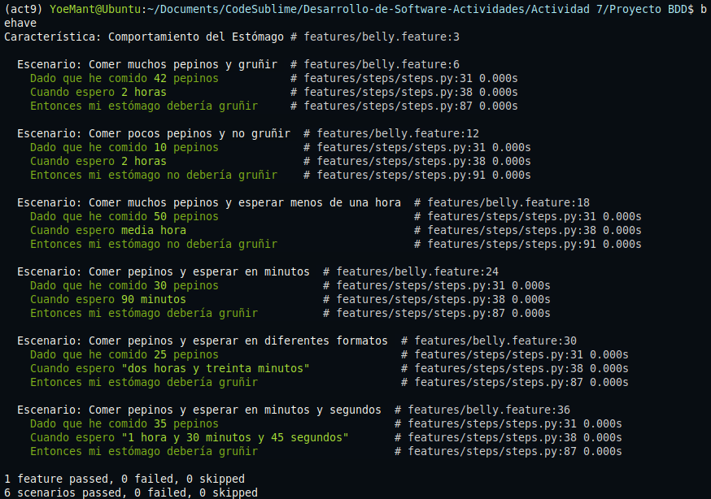

- Se ejecuta el comando `pytest -v`, el resultado fue exitoso, donde el metodo `gruñir` funciona correctamente.

  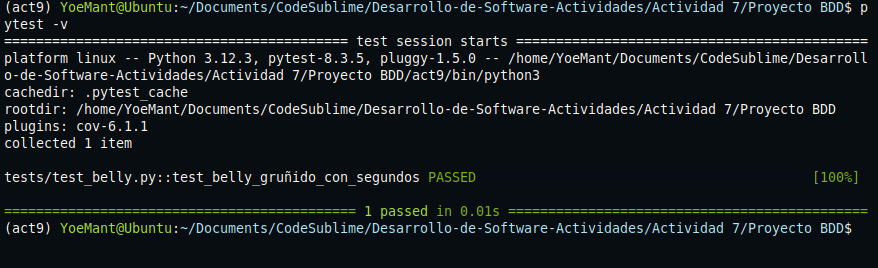

## Ejercicio 2:
## Manejo de cantidades fraccionarias de pepinos

### Añadir soporte para pepinos fraccionarios
Se agrega nuevo escenario en la prueba.
  ```text
    Escenario: Esperar usando horas en inglés
    Dado que he comido 20 pepinos
    Cuando espero "two hours and thirty minutes"
    Entonces mi estómago debería gruñir
  ```

  
Se modifica el decorador para que capure un numero entero.
```python
@given('que he comido {cukes:d} pepinos')
```
  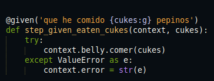

  - Se modifica el metodo `comer` de `belly.py` para que no acepte valores negativos.

  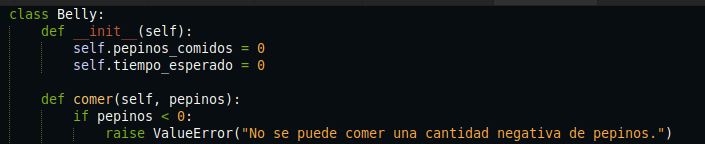

  - Se crea una prueba unitaria que verifique que el estómago gruñe cuando se comen 35 pepinos y se espera exactamente 1 hora, 30 minutos y 45 segundos
  
  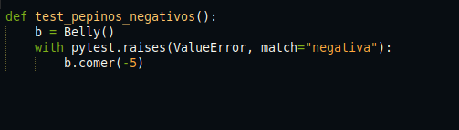


#### Resultados de las pruebas
  
  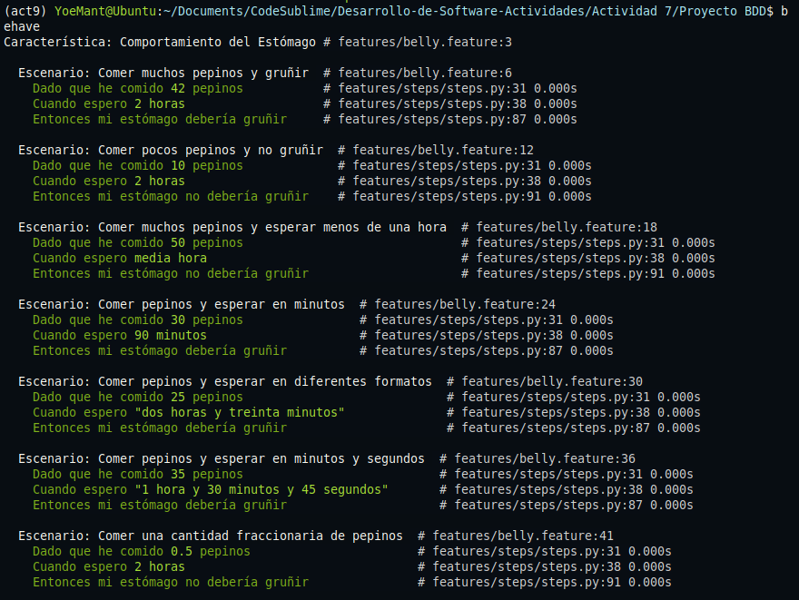

  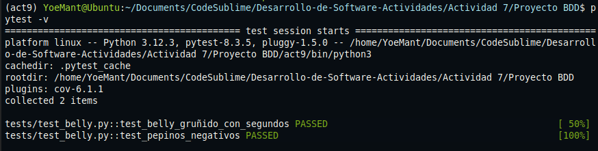

## Ejercicio 3:
## Soporte para idiomas múltiples (Español e Inglés)

**Actualizaciónn del pipeline para aceptar tags en @spannish e @english y ejecturar en etapas diferentes**

 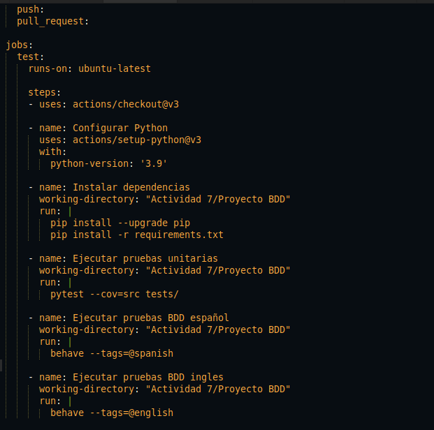

**Se agrega nuevo  un escenario:**

```text
Escenario: Esperar usando horas en inglés
  Dado que he comido 20 pepinos
  Cuando espero "two hours and thirty minutes"
  Entonces mi estómago debería gruñir
```
**Se actualizaron las siguientes funciones para que puedan aceptar horario en ingles y tambien los conectores como  and**

 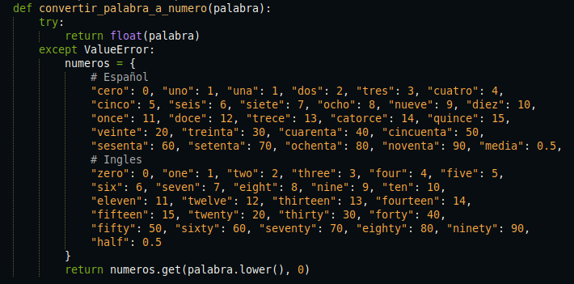

 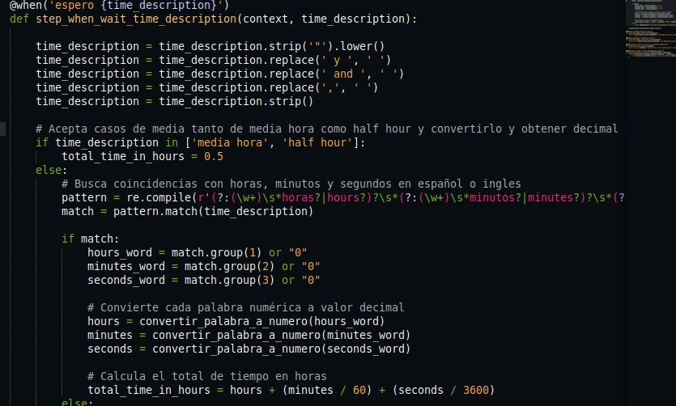
#### Resultado al ejecutar behave con en los escenarios solo de ingles y de español
 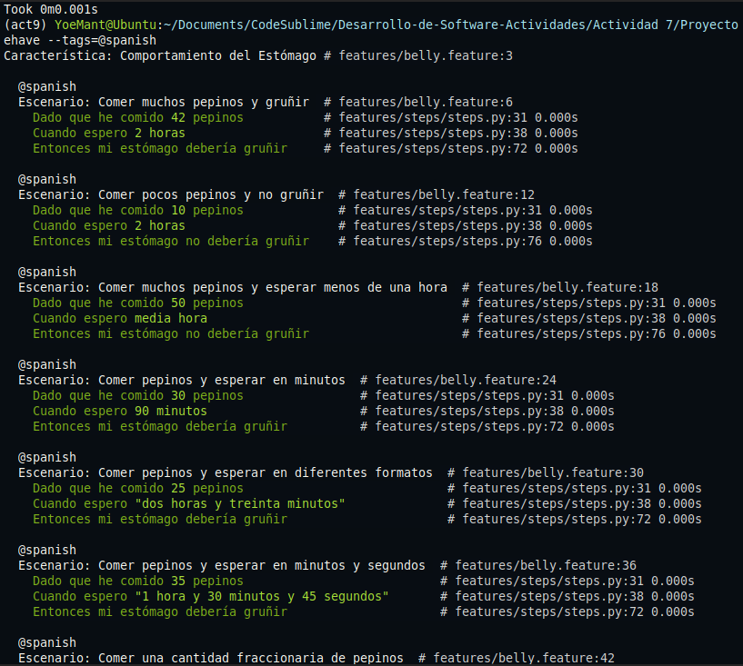
 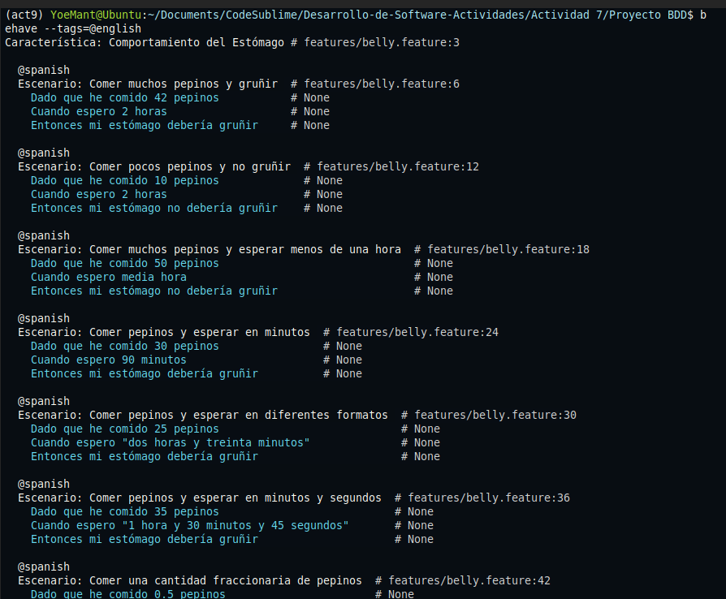
  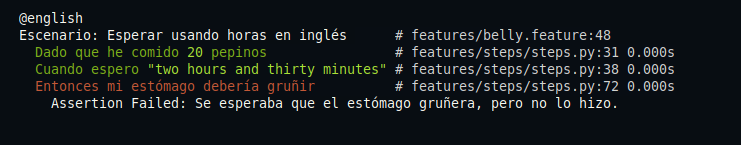

## Ejercicio 4:
## Manejo de tiempos aleatorios

**Se agrega nuevo  un escenario para tiempos aleatorios:**
```text
Escenario: Comer pepinos y esperar un tiempo aleatorio
  Dado que he comido 25 pepinos
  Cuando espero un tiempo aleatorio entre 1 y 3 horas
  Entonces mi estómago debería gruñir
```
**Se actualizaron stesp.py para que pueda aceptar un valor aleatorio dentro de un rango fijando una semilla
que garantiza resultados en CI/CD"**

  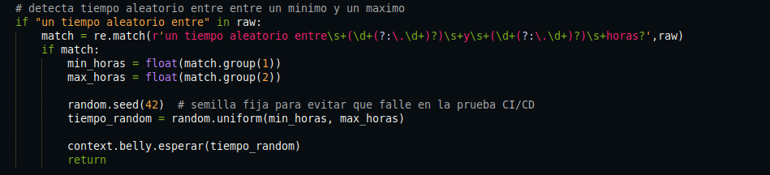

#### Resultado

  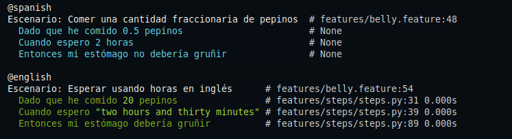

## Ejercicio5:
## Ejercicio 5: Validación de cantidades no válidas

**Se agrega nuevo  un escenario:**


```text
  @spanish
  Escenario: Manejar una cantidad no válida de pepinos más de 100
    Dado que he comido 120 pepinos
    Entonces debería ocurrir un error de cantidad negativa.
```
  **Se agrega nueva validacion para aceptar solo pepinos en un rango de 0 a 100, si estan fuera de este rango devuelve un mensaje**

  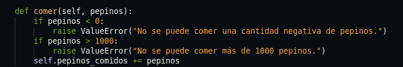

  **Verifica que paso durante el paso `Dado que he comido` y captura si hay un error**

  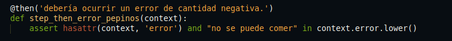

 **Se agrega una prueba cuando intenta comer 120 pepinos**

   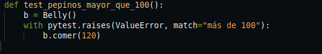

#### Resultado
   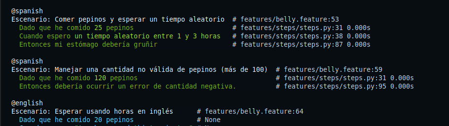
   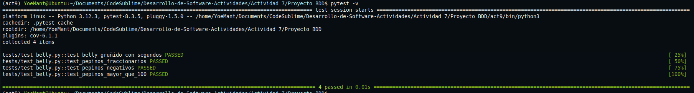

## Ejercicio6:
## Escalabilidad con grandes cantidades de pepinos