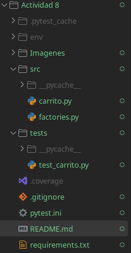
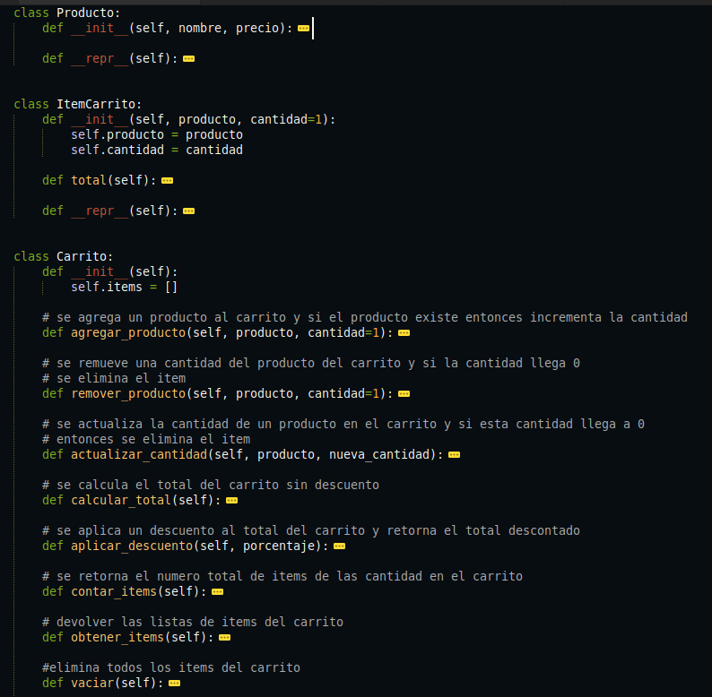
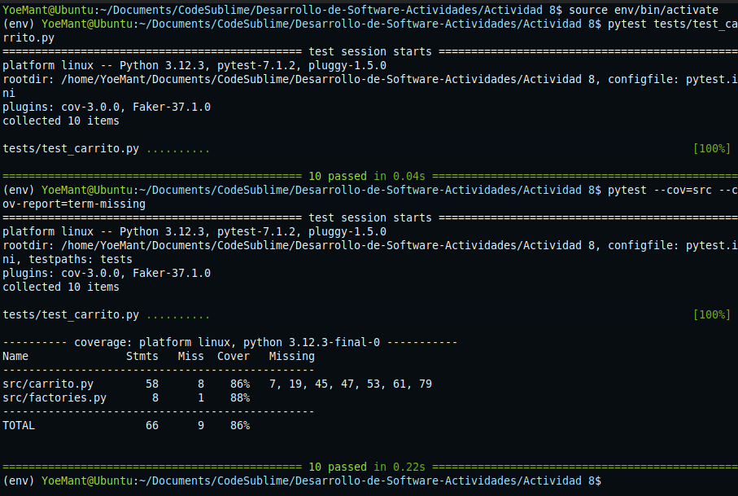

# Actividad 8


#### 1. Creación de la estructura del proyecto

```text
Desarrollo-de-Software-Actividades/
├── src/
│   ├── __init__.py
│   └── carrito.py
├── tests/
│   ├── __init__.py
│   └── test_carrito.py
├── pytest.ini
├── requirements.txt

```


#### 2.Se crea un archivo pytest.ini para que `pytest` encuentro los modulos
```text
[pytest]
pythonpath = .
testpaths = tests
```

#### 3. Se agrega las siguientes clases en el archivo `carrito.py`
```text
Producto: representa un producto personal
ItemCarrito : representa una entrada al carrito
Carrito: es el contenedor principal donde se agregan, actualizan y eliminan el producto

```


## Ejercicio 1: Método para vaciar el carrito

**Se añade el siguiente método que reemplaza la lista de items or una lista vacia**
```python
def vaciar(self):
	self.items=[]
```

**Se añade una prueba automatizada en test_carrito.py que comprueba si el carro queda vacio
  y al retornar una lista vacia**

```python
def test_vaciar_carrito():

    # Arrange, se crea carrito y se agregan productos
    carrito = Carrito()
    producto1 = ProductoFactory(nombre="Teclado", precio=100.00)
    producto2 = ProductoFactory(nombre="Mouse", precio=50.00)
    carrito.agregar_producto(producto1, cantidad=2)  # Total = 200
    carrito.agregar_producto(producto2, cantidad=1)  # Total = 50
    
    #Act, llama al metodo vaciar
    carrito.vaciar()

    # Assert, verificar que el carro este vacio y su total en 0
    assert carrito.obtener_items() == []
    assert carrito.calcular_total() == 0
```

**Resultados**

- Cuando ejecutamos `pytest --cov=src --cov-report=term-missing` nos entrega como resultado
   las 10 pruebas unitarias pasaron correctamente
- Cuando ejecutamos `pytest --cov=src --cov-report=term-missing`  nos muestra que el 86% es bueno
  , aunque no del todo, ya que hay lineas no cubiertas o evaluadas en el archivo `carrito.py`
	

