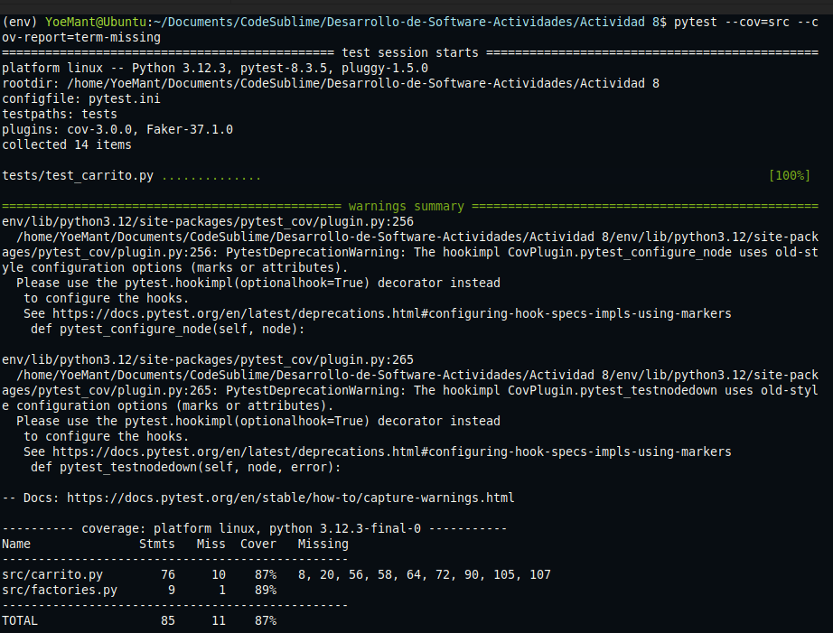

# Actividad 8


#### 1. Creación de la estructura del proyecto

```text
Desarrollo-de-Software-Actividades/
├── src/
│   ├── __init__.py
│   └── carrito.py
├── tests/
│   ├── __init__.py
│   └── test_carrito.py
├── pytest.ini
├── requirements.txt

```


#### 2.Se crea un archivo pytest.ini para que `pytest` encuentro los modulos
```text
[pytest]
pythonpath = .
testpaths = tests
```

#### 3. Se agrega las siguientes clases en el archivo `carrito.py`
```text
Producto: representa un producto personal
ItemCarrito : representa una entrada al carrito
Carrito: es el contenedor principal donde se agregan, actualizan y eliminan el producto

```


## Ejercicio 1: Método para vaciar el carrito

**Se añade el siguiente método que reemplaza la lista de items or una lista vacia**
```python
def vaciar(self):
	self.items=[]
```

**Se añade una prueba automatizada en test_carrito.py que comprueba si el carro queda vacio
  y al retornar una lista vacia**

```python
def test_vaciar_carrito():

    # Arrange, se crea carrito y se agregan productos
    carrito = Carrito()
    producto1 = ProductoFactory(nombre="Teclado", precio=100.00)
    producto2 = ProductoFactory(nombre="Mouse", precio=50.00)
    carrito.agregar_producto(producto1, cantidad=2)  # Total = 200
    carrito.agregar_producto(producto2, cantidad=1)  # Total = 50
    
    #Act, llama al metodo vaciar
    carrito.vaciar()

    # Assert, verificar que el carro este vacio y su total en 0
    assert carrito.obtener_items() == []
    assert carrito.calcular_total() == 0
```

**Resultados**

- Cuando ejecutamos `pytest --cov=src --cov-report=term-missing` nos entrega como resultado
   las 10 pruebas unitarias pasaron correctamente
- Cuando ejecutamos `pytest --cov=src --cov-report=term-missing`  nos muestra que el 86% es bueno
  , aunque no del todo, ya que hay lineas no cubiertas o evaluadas en el archivo `carrito.py`
	

## Ejercicio 2: Descuento por compra mínima

**Se implementa el metodo `aplicar_descuento_condicional`, aplica descuento si carrito>= minimo**
```python
    # aplica un descuento si el total del carrito es mayor o igual al minimo
    def aplicar_descuento_condicional(self, porcentaje, minimo):

        if porcentaje < 0 or porcentaje > 100:
            raise ValueError("El porcentaje debe estar entre 0 y 100")
        if minimo < 0:
            raise ValueError("El monto mínimo no puede ser negativo")

        total = self.calcular_total()
        if total >= minimo:
            descuento = total * (porcentaje / 100)
            return total - descuento
        return total
```
**Se implementa prueba unitaria tanto para el descuento condicional como el no condicional**

- Verifica que el descuento se aplique cuando el total del carrito cumple con el minimo
```python
sdef test_descuento_condicional_aplicado():

    # Arrange, se crea un carrito con un total mayor al minimo
    carrito = Carrito()
    producto = ProductoFactory(nombre="TV", precio=600.00)
    carrito.agregar_producto(producto, cantidad=1)  # Total = 600

    # Act, se aplica el descuento condicional
    total_con_descuento = carrito.aplicar_descuento_condicional(15, 500)

    # Assert, se crea un carrito con un total mayor al miniomo
    assert total_con_descuento == 510.00 

```
- Verifica que no se aplique ningun descuento si el  total es menor al minimo
```python
def test_descuento_condicional_no_aplicado():

    # Arrange, se crea un carrito con total menor al minimo
    carrito = Carrito()
    producto = ProductoFactory(nombre="Tablet", precio=300.00)
    carrito.agregar_producto(producto, cantidad=1)  # Total = 300

    # Act, aplica el descuento
    total_con_descuento = carrito.aplicar_descuento_condicional(15, 500)

    # Assert, se crea un carrito con total menos al minimo
    assert total_con_descuento == 300.00
```
**Resultados**
- Se ejecuta todas las pruebas y las 12 pruebas pasaron correctamente, tambien se ve 2 warning pero eso se debe al error del pytest-cov, y el 86% se debe a que hay linea faltantes que la prueba no esta ejecutanto.


## Ejercicio 3: Manejo de stock en producto

**Se añade el atributo stock a la clase `Producto` lo que permite que la cantidad maxima disponible para comprar un producto, tambien se modifica el metodo `agregar_producto()` para validar que la suma de cantidades no exceda ese límite.**

```python
class Producto:
    def __init__(self, nombre, precio, stock = 10):
        self.nombre = nombre
        self.precio = precio
        self.stock = stock

    def __repr__(self):
        return f"Producto({self.nombre}, {self.precio},stock ={self.stock})"

```

**El metodo `agregar_producto()` ahora verifica si la cantidad pedida supera el stock del producto, en ese caso lanza una excepción.**
```python
    # se agrega un producto al carrito y si el producto existe entonces incrementa la cantidad
    def agregar_producto(self, producto, cantidad=1):
        total_en_carrito = 0
        for item in self.items:
            if item.producto.nombre == producto.nombre:
                total_en_carrito += item.cantidad
                break

        if total_en_carrito + cantidad > producto.stock:
               raise ValueError("Cantidad a agregar excede el stock disponible")
    
               # si el producto ya esta solo suma
        for item in self.items:
             if item.producto.nombre == producto.nombre:
                  item.cantidad += cantidad
                  return

        self.items.append(ItemCarrito(producto, cantidad))
```

**Se actualiza también `ProductoFactory` para generar un stock aleatorio entre 1 y 100**
```python
import factory
from .carrito import Producto

class ProductoFactory(factory.Factory):
    class Meta:
        model = Producto

    nombre = factory.Faker("word")
    precio = factory.Faker("pyfloat", left_digits=2, right_digits=2, positive=True)
    stock = factory.Faker("pyint", min_value=1, max_value=100)

```
**Se añaden dos pruebas, una que verifica que se puede agregar un producto si la cantidad está dentro del stock y otra que lanza un error si se excede el stock.**

```python
def test_agregar_producto_excede_stock_lanza_excepcion():

    # Arrange, se crea un producto con stock limitado
    producto = Producto("SSD", 200.0, stock=4)
    carrito = Carrito()

    # Act & Assert: se intenta agregar mas de lo que se permite y
    # se captura el error.
    with pytest.raises(ValueError, match="Cantidad a agregar excede el stock disponible"):
        carrito.agregar_producto(producto, cantidad=5)
```
**Resultados**

- Se confirman 14 pruebas unitarias exitosas.


## Ejercicio 4: Ordenar items del carrito

**se añade el método `obtener_items_ordenados` a la clase `Carrito` que permite ordenar los productos del carrito por nombre o precio unitario**
```python
    # se retorna la lista de items ordenados segun precio o nombre
    def obtener_items_ordenados(self, criterio: str):

        if criterio == "precio":
            return sorted(self.items, key=lambda item: item.producto.precio)
        elif criterio == "nombre":
            return sorted(self.items, key=lambda item: item.producto.nombre.lower())
        else:
            raise ValueError("Criterio inválido. Usa 'precio' o 'nombre'.")

```

**Se agregan tres pruebas unitarias para verificar el funcionamiento del ordenamiento y la validación**
```python
# ordenamiento correcto por precio
def test_ordenar_items_por_precio():

    #Arrange, se agrega productos con distintos precios.
    carrito = Carrito()
    producto1 = Producto("A", 300.0, stock=10)
    producto2 = Producto("B", 100.0, stock=10)
    producto3 = Producto("C", 200.0, stock=10)
    carrito.agregar_producto(producto1)
    carrito.agregar_producto(producto2)
    carrito.agregar_producto(producto3)

    #Act, se obtiene items ordenados por precio
    ordenados = carrito.obtener_items_ordenados("precio")

    #Assert, se verifica que el orden sea ascendente por precio
    precios = [item.producto.precio for item in ordenados]
    assert precios == [100.0, 200.0, 300.0]

# ordenamiento correcto por nombre
def test_ordenar_items_por_nombre():

    #Arrange, se agrega productos con distintos nombres
    carrito = Carrito()
    producto1 = Producto("Zanahoria", 10.0, stock=10)
    producto2 = Producto("Banana", 20.0, stock=10)
    producto3 = Producto("Aguacate", 30.0, stock=10)
    carrito.agregar_producto(producto1)
    carrito.agregar_producto(producto2)
    carrito.agregar_producto(producto3)

    #Act, se obtiene items ordenados por nombre
    ordenados = carrito.obtener_items_ordenados("nombre")

    #Assert, se verifica que el orden sea alfabético
    nombres = [item.producto.nombre for item in ordenados]
    assert nombres == ["Aguacate", "Banana", "Zanahoria"]

# validacion de criterio invalido
def test_ordenar_items_criterio_invalido():
    #Arrange, se agrega un producto al carrito
    carrito = Carrito()
    producto = Producto("X", 100.0, stock=5)
    carrito.agregar_producto(producto)

    #Act y Assert, se verifica que usar un criterio invalido lanza excepcion
    with pytest.raises(ValueError, match="Criterio inválido"):
        carrito.obtener_items_ordenados("peso")
```
**Resultados**

- Se ejecutaron 17 pruebas unitarias en total, todas pasaron las pruebas correctamente, lo cual confirma que la logica de ordenamiento funciona bien


## Ejercicio 5: Uso de Pytest Fixtures

**Se crean fixtures en el archivo `conftest.py` para reutilizar instancias comunes como `Carrito` y `Producto` en múltiples pruebas**

```python
import pytest
from src.carrito import Carrito
from src.factories import ProductoFactory

@pytest.fixture
def carrito():
    return Carrito()

@pytest.fixture
def producto_generico():
    return ProductoFactory(nombre="Genérico", precio=100.0, stock=10)

```

**Se refactorizan las pruebas para aprovechar estas fixtures haciendo que Pytest las inyecte automáticamente al declararlas como parametros**
```python
def test_agregar_producto_nuevo(carrito,producto_generico):

    # Act: se agrega el producto al carrito
    carrito.agregar_producto(producto_generico)
    
    # Assert: se verifica que el carrito contiene un item con el producto y cantidad 1
    items = carrito.obtener_items()
    assert len(items) == 1
    assert items[0].producto.nombre == "Genérico"
    assert items[0].cantidad == 1
```

**Resultados**
- Se ejecutaron 17 pruebas unitarias en total, todas pasaron correctamente, lo que confirma que la refactorizacion con fixture no afecto sistema


## Ejercicio 6: Pruebas parametrizadas

**Se utiliza `@pytest.mark.parametrize` para probar múltiples escenarios con una sola función de prueba lo que mejora**

**Se evalua varios casos combinados de precio, cantidad y porcentaje de descuento**
```python
def test_aplicar_descuento_parametrizado(precio_unitario, cantidad, descuento, total_esperado):

    # Arrange, se crea carrito con un producto dado
    carrito = Carrito()
    producto = Producto("Promo", precio_unitario, stock=10)
    carrito.agregar_producto(producto, cantidad)

    # Act, se aplica descuento
    total_con_descuento = carrito.aplicar_descuento(descuento)

    # Assert, se compra con el total esperado
    assert total_con_descuento == total_esperado

```

**Se validan las cantidades lo que incluye eliminar el producto tambien y las cantidades negativas**
```python
def test_actualizar_cantidad_parametrizada(nueva_cantidad, debe_fallar):

    # Arrange, se crea carrito y producto.
    carrito = Carrito()
    producto = Producto("Item", 50, stock=10)
    carrito.agregar_producto(producto, cantidad=2)

    # Act y assert, se erifica comportamiento según cantidad valida o no
    if debe_fallar:
        with pytest.raises(ValueError):
            carrito.actualizar_cantidad(producto, nueva_cantidad)
    else:
        carrito.actualizar_cantidad(producto, nueva_cantidad)
        cantidad_resultante = sum(i.cantidad for i in carrito.obtener_items())
        assert cantidad_resultante == nueva_cantidad

```
**Resultados**

- Se ejecutaron 25 pruebas que pasaron correctamente, esto confirma que las pruebas parametrizadas fueron integradas correctamente


## Ejercicio 7: Calcular impuestos en el carrito

**Se crea un archivo `test_impuesto.py` con la siguiente prueba**
```python
# tests/test_impuestos.py

import pytest
from src.carrito import Carrito
from src.factories import ProductoFactory

def test_calcular_impuestos():
    """
    Red: Se espera que calcular_impuestos retorne el valor del impuesto.
    """
    # Arrange
    carrito = Carrito()
    producto = ProductoFactory(nombre="Producto", precio=250.00, stock=10)
    carrito.agregar_producto(producto, cantidad=4)  # Total = 1000

    # Act
    impuesto = carrito.calcular_impuestos(10)  # 10% de 1000 = 100

    # Assert
    assert impuesto == 100.00

```
**La prueba falla debido a que el metodo `calcular_impueesto` no a sido integrado**

**Se implementa el metodo `calcular_impuestos` en la clase `Carrito`
el cual calcula impuesto basado en el porcentaje**

```python
def calcular_impuestos(self, porcentaje):
    """
    Calcula el valor de los impuestos basados en el porcentaje indicado.

    Args:
        porcentaje (float): Porcentaje de impuesto a aplicar (entre 0 y 100).

    Returns:
        float: Monto del impuesto.

    Raises:
        ValueError: Si el porcentaje no está entre 0 y 100.
    """
    if porcentaje < 0 or porcentaje > 100:
        raise ValueError("El porcentaje debe estar entre 0 y 100")
    total = self.calcular_total()
    return total * (porcentaje / 100)

```
**Resultados**

- Calcular impuestos en el carrito sigue el enfoque Red-Green-Refactor que presenta una falla por que el metodo `calcular_impuestos ` no existia , Green por que se implemento la clase `Carrito` y Refactor que se le agrega la validacion


## Ejercicio 8: Aplicar cupón de descuento con límite máximo

**Se crea una prueba `test_aplicar_cupon_con_limite` que intenta usar un metodo aun existente**

```python
def test_aplicar_cupon_con_limite():
    """
    Red: Se espera que al aplicar un cupón, el descuento no supere el límite máximo.
    """
    # Arrange
    carrito = Carrito()
    producto = ProductoFactory(nombre="Producto", precio=200.00)
    carrito.agregar_producto(producto, cantidad=2)  # Total = 400

    # Act
    total_con_cupon = carrito.aplicar_cupon(20, 50)  # 20% de 400 = 80 → límite = 50

    # Assert
    assert total_con_cupon == 350.00

```
**Primer resultado al ejecutar `pytest tests/test_cupon.py` presenta una falla debido a que aun no existe el metodo**


**Se agrega el método dentro de la clase `Carrito` en `src/carrito.py`**
```python
def aplicar_cupon(self, descuento_porcentaje, descuento_maximo):
    total = self.calcular_total()
    descuento_calculado = total * (descuento_porcentaje / 100)
    descuento_final = min(descuento_calculado, descuento_maximo)
    return total - descuento_final

```
**Segundo resultado**


**Se mejora el metodo añadiendo validaciones**
```python
def aplicar_cupon(self, descuento_porcentaje, descuento_maximo):
    """
    Aplica un cupón de descuento al total del carrito, asegurando que el descuento no exceda el máximo permitido.
    
    Args:
        descuento_porcentaje (float): Porcentaje de descuento a aplicar.
        descuento_maximo (float): Valor máximo de descuento permitido.
    
    Returns:
        float: Total del carrito después de aplicar el cupón.
    
    Raises:
        ValueError: Si alguno de los valores es negativo.
    """
    if descuento_porcentaje < 0 or descuento_maximo < 0:
        raise ValueError("Los valores de descuento deben ser positivos")
    
    total = self.calcular_total()
    descuento_calculado = total * (descuento_porcentaje / 100)
    descuento_final = min(descuento_calculado, descuento_maximo)
    return total - descuento_final
```
**Tercera resultado**
