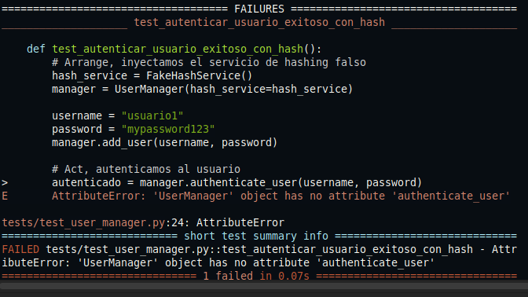
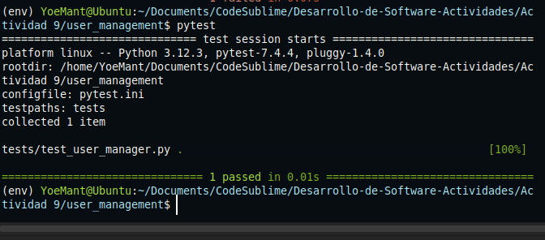
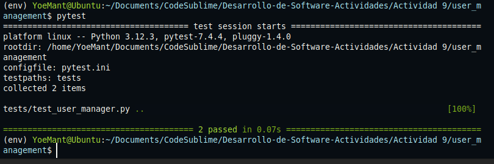
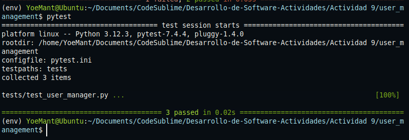
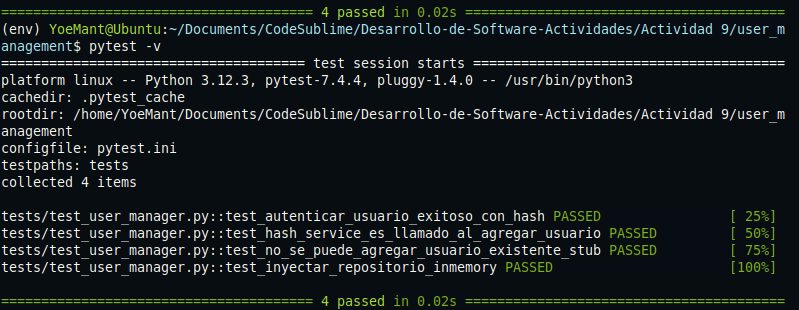
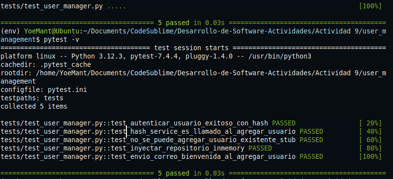

# Actividad 8


#### 1. Creación de la estructura del proyecto

```text
user_management/
├── user_manager.py
└── tests/
    └── test_user_manager.py
```


## Iteración 1: Agregar usuario (Básico)

**Se escribe una prueba automatizada para verificar que un usuario pueda ser agregado correctamente**

```python
def test_agregar_usuario_exitoso():
    # Arrange: se crea una instancia de UserManager y se define sus datos
    manager = UserManager()
    username = "kapu"
    password = "securepassword"

    # Act: agregamos usuario
    manager.add_user(username, password)

    # Assert: verificamos que el usuario fue registrado
    assert manager.user_exists(username), "El usuario debería existir después de ser agregado."
```
**Si se ejecuta `pytest` la prueba fallara debido a que aun no se ha h implementado la clase `UserManager`**
`


**Se implemento la clase `UserManager` y el método `add_user()` para que la prueba pase correctamente**

```python
class UserAlreadyExistsError(Exception):
    pass

class UserManager:
    def __init__(self):
        self.users = {}

    def add_user(self, username, password):
        if username in self.users:
            raise UserAlreadyExistsError(f"El usuario '{username}' ya existe.")
        self.users[username] = password

    def user_exists(self, username):
        return username in self.users
```

**Ahora con la implementacion de la clase `UserManager` se ejecuta correctamente**


## Iteración 2: Autenticación de usuario (Introducción de una dependencia para Hashing)

**(RED)Se implementa una prueba unitaria para verificar que se puede autenticar  correctamente a un usuario usando hasshing** 
```python
class FakeHashService:
    def hash(self, plain_text: str) -> str:
        return f"fakehash:{plain_text}"

    def verify(self, plain_text: str, hashed_text: str) -> bool:
        return hashed_text == f"fakehash:{plain_text}"


def test_autenticar_usuario_exitoso_con_hash():
    # Arrange, inyectamos el servicio de hashing falso
    hash_service = FakeHashService()
    manager = UserManager(hash_service=hash_service)

    username = "usuario1"
    password = "mypassword123"
    manager.add_user(username, password)

    # Act, autenticamos al usuario
    autenticado = manager.authenticate_user(username, password)

    # Assert, debe autenticarse correctamente
    assert autenticado, "El usuario debería autenticarse correctamente con la contraseña correcta."
```
**Cuando se ejecute la prueba fallara ya que no se implemento `authenticate_user`**


**(Green)e implementa el metodo `authenticate_user` y se permite la inyeccion del servicio hashing**

```python
class UserNotFoundError(Exception):
    pass

class UserAlreadyExistsError(Exception):
    pass

class UserManager:
    def __init__(self, hash_service=None):
        self.users = {}
        self.hash_service = hash_service

        if not self.hash_service:
            class DefaultHashService:
                def hash(self, plain_text: str) -> str:
                    return plain_text

                def verify(self, plain_text: str, hashed_text: str) -> bool:
                    return plain_text == hashed_text
            self.hash_service = DefaultHashService()

    def add_user(self, username, password):
        if username in self.users:
            raise UserAlreadyExistsError(f"El usuario '{username}' ya existe.")
        hashed_pw = self.hash_service.hash(password)
        self.users[username] = hashed_pw

    def user_exists(self, username):
        return username in self.users

    def authenticate_user(self, username, password):
        if not self.user_exists(username):
            raise UserNotFoundError(f"El usuario '{username}' no existe.")
        stored_hash = self.users[username]
        return self.hash_service.verify(password, stored_hash)
```

**Resultado:**

- Esto confirma que la autenticación con un servicio de hashing inyectado mediante dependencias funciona como se espera usando un `FakeHashService`



## Iteración 3: Uso de un Mock para verificar llamadas (Spy / Mock)


**Se escribe una prueba automatizada para verificar que al ejecutar `add_user()`y se llama al método `hash`**

```python
def test_hash_service_es_llamado_al_agregar_usuario():
    # Arrange, se crea un servicio de hashing simulado usando MagicMock
    mock_hash_service = MagicMock()
    manager = UserManager(hash_service=mock_hash_service)
    username = "spyUser"
    password = "spyPass"

    # Act, se agrega el usuario
    manager.add_user(username, password)

    # Assert, se verifica que se llamó hash exactamente una vez
    mock_hash_service.hash.assert_called_once_with(password)
```

**Resultado, las pruebas pasaron correctamente al llamar a hash**


## Iteración 4: Excepción al agregar usuario existente (Stubs/más pruebas negativas)

**Se escribe una prueba que simula que el usuario ya existe usando un `Stub`, realizando esto se verificar que `add_user` lanza una excepción sin depender del estado interno real del sistema**

```python  
def test_no_se_puede_agregar_usuario_existente_stub():
    # Este stub forzará que user_exists devuelva True
    class StubUserManager(UserManager):
        def user_exists(self, username):
            return True  # Siempre dice que el usuario ya existe

    stub_manager = StubUserManager()

    with pytest.raises(UserAlreadyExistsError) as exc:
        stub_manager.add_user("cualquier", "1234")

    assert "ya existe" in str(exc.value)
```

**Resultado: `UserManager` lanza correctamente `UserAlreadyExistsError` si el usuario ya existe**


## Iteración 5: Agregar un "Fake" repositorio de datos (Inyección de Dependencias)

**Se escribe una prueba unitaria que valida que se puede inyectar un repositorio externo en `UserManager` y que el usuario se guarda correctamente**

```python
class InMemoryUserRepository:
    """Fake de un repositorio de usuarios en memoria."""
    def __init__(self):
        self.data = {}

    def save_user(self, username, hashed_password):
        if username in self.data:
            raise UserAlreadyExistsError(f"'{username}' ya existe.")
        self.data[username] = hashed_password

    def get_user(self, username):
        return self.data.get(username)

    def exists(self, username):
        return username in self.data

def test_inyectar_repositorio_inmemory():
    repo = InMemoryUserRepository()
    manager = UserManager(repo=repo)  # inyectamos repo
    username = "fakeUser"
    password = "fakePass"

    manager.add_user(username, password)
    assert manager.user_exists(username)
```

**Modificamos y agregamos soporte para inyeccion de un repositorio externo y se encapsula el repositorio interno como fallback**
```python
class UserManager:
    def __init__(self, hash_service=None, repo=None):
        self.hash_service = hash_service or self._default_hash_service()
        self.repo = repo or self._default_repo()

    def _default_hash_service(self):
        class DefaultHashService:
            def hash(self, plain_text: str) -> str:
                return plain_text
            def verify(self, plain_text: str, hashed_text: str) -> bool:
                return plain_text == hashed_text
        return DefaultHashService()

    def _default_repo(self):
        class InternalRepo:
            def __init__(self):
                self.data = {}
            def save_user(self, username, hashed_password):
                if username in self.data:
                    raise UserAlreadyExistsError(f"'{username}' ya existe.")
                self.data[username] = hashed_password
            def get_user(self, username):
                return self.data.get(username)
            def exists(self, username):
                return username in self.data
        return InternalRepo()

    def add_user(self, username, password):
        hashed = self.hash_service.hash(password)
        self.repo.save_user(username, hashed)

    def user_exists(self, username):
        return self.repo.exists(username)

    def authenticate_user(self, username, password):
        stored_hash = self.repo.get_user(username)
        if stored_hash is None:
            raise UserNotFoundError(f"El usuario '{username}' no existe.")
        return self.hash_service.verify(password, stored_hash)

```
**Resultado: todos los tests pasaron usando un repositorio inyectado Fake,
`UserManager` ahora es desacoplado, flexible y fácilmente testeable**


## Iteración 6: Introducir un “Spy” de notificaciones (Envío de correo)

**Se escribio una prueba que usa un Mock como Spy para asegurar que el correo fue enviado**

```python
def test_envio_correo_bienvenida_al_agregar_usuario():
    
    #Arrange, se crea un mock de un servicio de email y se inyecta en UserManager

    mock_email_service = MagicMock()
    manager = UserManager(email_service=mock_email_service)
    username = "nuevoUsuario"
    password = "NuevaPass123!"

    # Act, Se agrega un usuario.
    manager.add_user(username, password)
   
    #Assert, Se verifica que el servicio de email fue llamado correctamente
    mock_email_service.send_welcome_email.assert_called_once_with(username)
```

**Se modificó la clase UserManager para usar el servicio inyectado**

```python
    def add_user(self, username, password):
        hashed = self.hash_service.hash(password)
        self.repo.save_user(username, hashed)
        if self.email_service:
            self.email_service.send_welcome_email(username)
```

**Resultado: se valido que al agregar un usuario el metodo `send_welcome_email()` del servicio de correo fue llamado correctamente usando un Spy**

