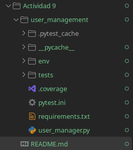
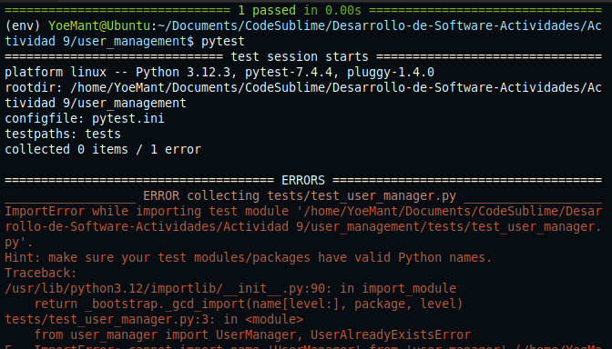
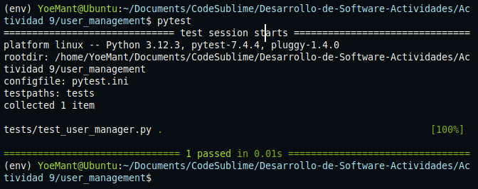

# Actividad 8


#### 1. Creación de la estructura del proyecto

```text
user_management/
├── user_manager.py
└── tests/
    └── test_user_manager.py
```


## Iteración 1: Agregar usuario (Básico)

**Se escribe una prueba automatizada para verificar que un usuario pueda ser agregado correctamente**

```python
def test_agregar_usuario_exitoso():
    # Arrange: se crea una instancia de UserManager y se define sus datos
    manager = UserManager()
    username = "kapu"
    password = "securepassword"

    # Act: agregamos usuario
    manager.add_user(username, password)

    # Assert: verificamos que el usuario fue registrado
    assert manager.user_exists(username), "El usuario debería existir después de ser agregado."
```
**Si se ejecuta `pytest` la prueba fallara debido a que aun no se ha h implementado la clase `UserManager`**
`



**Se implemento la clase `UserManager` y el método `add_user()` para que la prueba pase correctamente**

```python
class UserAlreadyExistsError(Exception):
    pass

class UserManager:
    def __init__(self):
        self.users = {}

    def add_user(self, username, password):
        if username in self.users:
            raise UserAlreadyExistsError(f"El usuario '{username}' ya existe.")
        self.users[username] = password

    def user_exists(self, username):
        return username in self.users
```

**Ahora con la implementacion de la clase `UserManager` se ejecuta correctamente**




# Iteración 2: Autenticación de usuario (Introducción de una dependencia para Hashing)


