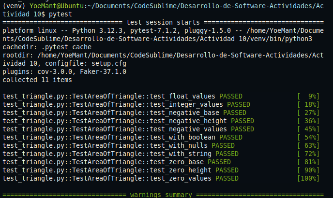
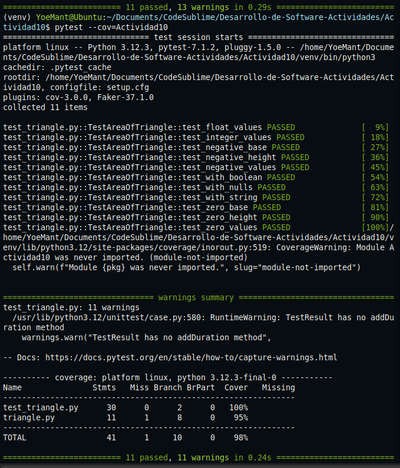
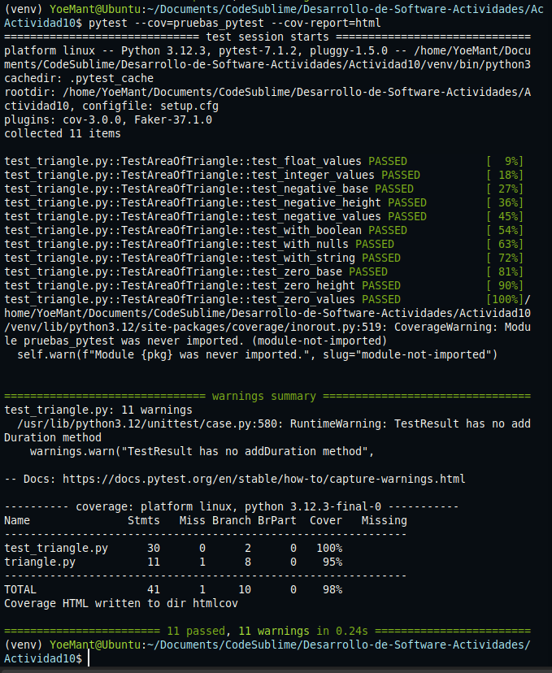
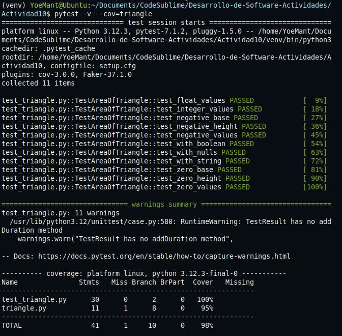
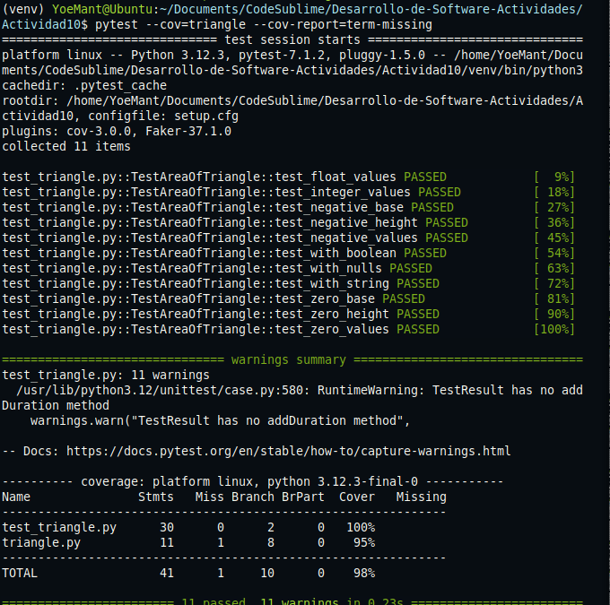

# Actividad 10

**Se ejecutaron 11 pruebas unitarias del archivo `test_triangle.py`, y todas pasaron correctamente, el modo `-v` muestra el nombre de cada prueba con mayor detalle.**

**El comando `pytest --cov=Actividad10` ejecuto correctamente las pruebas**

**El comando `pytest --cov=pruebas_pytest --cov-report=html` ejecuto correctamente las pruebas y generó el reporte HTML**

**El comando `pytest -v --cov=triangle` se ejecuto todo correctamente las 11 pruebas**

**Se ejecuto correctamente el comando `pytest --cov=triangle --cov-report=term-missing`, este comando es util porque muestra exactamente que líneas no estan cubiertas por las pruebas**

