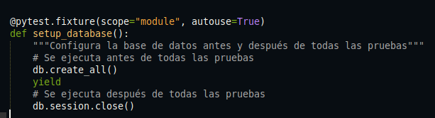
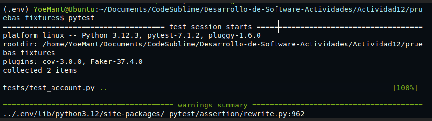
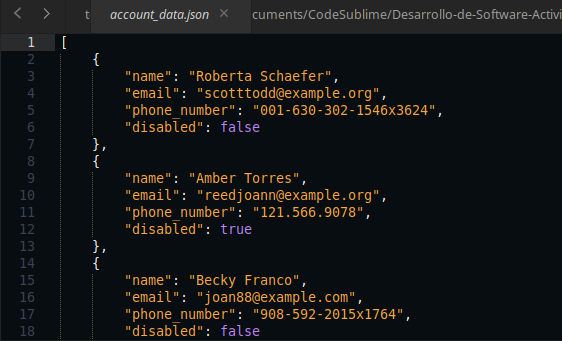
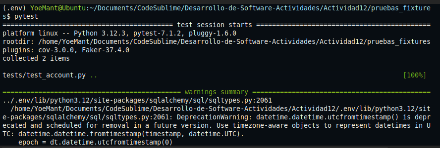
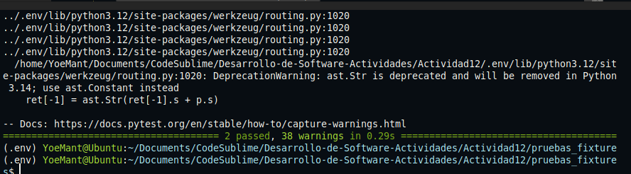

# Actividad 12

**Paso1**

Crear un fixture a nivel de módulo que se ejecute automáticamente antes de todas las pruebas, y que inicialice la base de datos con `db.create_all()` y la cierre con `db.session.close()`


Al ejecutar `pytest` se observa que todas pasaron correctamente, esto confirma que el fixture `setup_database` con `scope="module"` se ejecuto correctamente, inicializando la base de datos con `db.create_all()` antes de las pruebas y cerrando la conexión con db.session.close() al final del módulo. 



**Paso2**

Se cargan los datos de prueba desde el archivo `account_data.json` una solo vez antes de todas
las pruebas de la clas, utilizando el metodo especial `setup_class`



```python
import json

with open('tests/fixtures/account_data.json') as json_data:
    ACCOUNT_DATA = json.load(json_data)
```

El método `setup_class` se ejecuta una sola vez antes de cualquier prueba en la clase `TestAccountModel`, cargando correctamente los datos del archivo `account_data.json` en una variable global `ACCOUNT_DATA`

Al ejecutar pytest se observa que las pruebas que dependen de `ACCOUNT_DATA` datos cargados desde el archivo `account_data.json` pasaron correctamente.


**Paso3**

Se valida el método `create()` de la clase `Account` permite insertar correctamente un nuevo registro en la base de datos y que `Account.all()` lo devuelve.

```python
def test_create_an_account(self):
        """Probar la creación de una sola cuenta"""
        data = ACCOUNT_DATA[0]  # obtener la primera cuenta
        account = Account(**data)
        account.create()
        assert len(Account.all()) == 1
```
Este caso de prueba verifica que el método `create()` funciona correctamente y que la base de datos está operativa.

Al ejecutar pytest se confirma que la cuenta fue creada correctamente y que `Account.all()`devuelve una lista con exactamente un elemento. Esto indica que la inserción y la consulta de datos están funcionando correctamente.

**Paso4**

Se verifica que se pueden crear multiples cuentas a partir de los datos cargados desde el archivo `account_data.json`, y que todas quedan correctamente registradas en la base de datos.

```python
def test_create_all_accounts(self):
        """Probar la creación de múltiples cuentas"""
        for data in ACCOUNT_DATA:
            account = Account(**data)
            account.create()
        assert len(Account.all()) == len(ACCOUNT_DATA)
```
a ejecución sin errores al correr pytest valida que el método `create()` es estable incluso cuando se usa repetidamente.

