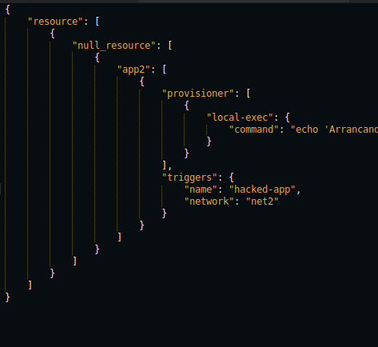

# Actividad: Infraestructura como código local con Terraform

**Fase0**

- Revisar el estructura modular del proyecto


- Verificar ejecucion 


- Se generaron 10 entornos


- verificacion de ejecucion del entorno


**Fase 1**

Se genera el entorno `app1` mediante el script `generate_envs.py`.

Luego en `environments/app1`, se ejecuta el comando `terraform init` para inicializar el backend de Terraform y descargar los proveedores necesarios.

```bash
cd environments/app1
terraform init
```


Al completarse la inicialización sin errores, se ejecuta el comando `terraform plan` para verificar qué acciones realizará Terraform sobre la infraestructura declarada en `main.tf.json`.

```bash
terraform plan
```


Terraform indica que se creará el recurso `null_resource.app1`, con los siguientes triggers:

* `"name" = "app1"`
* `"network" = "net1"`

Esto confirma que los archivos fueron generados correctamente y que la infraestructura está lista para aplicarse.


**Fase 2**


Se simula un cambio manual fuera del flujo de infraestructura como código, 
```json
el siguiente
"name": "app2"
por
"name": "hacked-app"
```


Este tipo de modificación representa un **drift** ya que altera el estado real sin modificar la fuente original 
Luego se ejecuta:

```bash
terraform plan
```

Terraform detecta la discrepancia entre el estado deseado y el estado real y propone revertir el cambio:

Al aplicar el plan con:

```bash
terraform apply
```


Terraform restaura el valor original de `"name": "app2"`, demostrando su capacidad de ralizar el camboi.