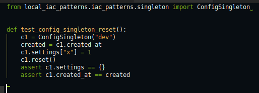

# Actividad21: Patrones para módulos de infraestructura


## Fase 0

. **Ubícate en el proyecto**:

   ```bash
   cd local_iac_patterns
   ```

**Activa entorno virtual**:

   ```bash
   python -m venv .venv && source .venv/bin/activate
   pip install --upgrade pip
   ```

**Genera la infraestructura base**:

   ```bash
   python generate_infra.py
   ```

**Valida con Terraform**:

   ```bash
   cd terraform
   terraform init
   terraform validate
   ```

**Resultado**


## Fase1

**1. Singleton**
```python
# singleton.py
import threading
from datetime import datetime

class SingletonMeta(type):
    _instances: dict = {}
    _lock: threading.Lock = threading.Lock()

    def __call__(cls, *args, **kwargs):
        with cls._lock:
            if cls not in cls._instances:
                instance = super().__call__(*args, **kwargs)
                cls._instances[cls] = instance
        return cls._instances[cls]

class ConfigSingleton(metaclass=SingletonMeta):
    def __init__(self, env_name: str):
        self.env_name = env_name
        self.settings: dict = {}
        self.created_at: str = datetime.utcnow().isoformat()

```
El patron singleton garantiza que una clase tenga una unica instancia en todo el sistema, en este caso se usa una metaclase llamada SingletonMeta que intercepta la creación de instancias y almacena cada una en un diccionario interno. Si ya existe una instancia para esa clase simplemente se devuelve la existente.

La implementacion es segura para entornos con multiples hilos gracias al uso de un Lock de la libreria threading. Esto evita condiciones de carrera cuando dos hilos intentan crear la instancia al mismo tiempo.

**2. Factory**

```python
# factory.py
import uuid
from datetime import datetime

class NullResourceFactory:
    @staticmethod
    def create(name: str, triggers: dict = None) -> dict:
        triggers = triggers or {
            "factory_uuid": str(uuid.uuid4()),
            "timestamp": datetime.utcnow().isoformat()
        }
        return {
            "resource": {
                "null_resource": {
                    name: {"triggers": triggers}
                }
            }
        }
```
El patron factory encapsula la logica de creacion de objetos, lo que en este caso la clase `NullResourceFactory` genera estructuras válidas para Terraform que representan recursos del tipo null_resource.

El metodo create acepta un nombre de recurso y un diccionario opcional de triggers. Si no se proporcionan triggers se generan por defecto dos valores, un `UUID` aleatorio y un timestamp en `UTC`, entonces en estos triggers son claves porque permiten que Terraform detecte cambios y regenere recursos si es necesario.


**3. Prototype**
```python
# prototype.py
from copy import deepcopy
from typing import Callable

class ResourcePrototype:
    def __init__(self, template: dict):
        self.template = template

    def clone(self, mutator: Callable[[dict], None]) -> dict:
        new_copy = deepcopy(self.template)
        mutator(new_copy)
        return new_copy
```
El patron Prototype permite clonar objetos de forma segura y aplicarles modificaciones sin afectar el original, la clase `ResourcePrototype`almacena un recurso base y expone un método clone que realiza una copia profunda del recurso  y luego aplica una función opcional llamada mutator.


**4. COmposite**
```python
# composite.py
from typing import List, Dict

class CompositeModule:
    def __init__(self):
        self.children: List[Dict] = []

    def add(self, block: Dict):
        self.children.append(block)

    def export(self) -> Dict:
        merged: Dict = {"resource": {}}
        for child in self.children:
            # Imagina que unimos dicts de forma recursiva
            for rtype, resources in child["resource"].items():
                merged["resource"].setdefault(rtype, {}).update(resources)
        return merged
```
El patron composite permite tratar multiples objetos individuales como una unica unidad compuesta, en este caso `CompositeModule` es una clase que agrega varios bloques de recursos Terraform en una estructura unificada, lo que los recursos se agregan como diccionarios y luego, mediante el metodo export se combinan todos en un solo json bajo la clave `resource`.


**5. BUilder**
```python
# builder.py
import json
from composite import CompositeModule
from factory import NullResourceFactory
from prototype import ResourcePrototype

class InfrastructureBuilder:
    def __init__(self):
        self.module = CompositeModule()

    def build_null_fleet(self, count: int):
        base = NullResourceFactory.create("app")
        proto = ResourcePrototype(base)
        for i in range(count):
            def mutator(block):
                # Renombrar recurso "app" a "app_<i>"
                res = block["resource"]["null_resource"].pop("app")
                block["resource"]["null_resource"][f"app_{i}"] = res
            self.module.add(proto.clone(mutator))
        return self

    def export(self, path: str = "terraform/main.tf.json"):
        with open(path, "w") as f:
            json.dump(self.module.export(), f, indent=2)
````
El patron builder permite construir objetos complejos paso a paso de forma fluida y encadenada, la clase `InfrastructureBuilder` cordina los tres patrones anteriores y usa factory para crear el recurso base, prototype para clonar y mutar, y composite para agrupar los resultados.

## Fase 2

- Agregamos un metodo `reset` que limpiea `settings` pero mantenga `created_at`


- Validamos, creamos un archivo `test_singleton.py` con el siguiente contenido, dentro de `test`



- EJecutamos la prueba

