# Actividad 22

## Preguntas teorica

### 1. Idempotencia y Mediador


La idempotencia significa que ejecutar la misma operacion multiples veces produce el mismo resultado final.

Como por ejemplo crear una red llamada "network" siempre debe resultar en una sola red con ese nombre independientemente de cuantas veces se ejecute.

El mediador coordina, sin idempotencia el mediador puede crear recursos duplicados porque invoca los mismos modulos multiples veces durante la resolucion de dependencias.

**problema sin idempotencia**

```python
def _create(self, module):
    if isinstance(module, FirewallFactoryModule):
        srv_out = self._create(ServerFactoryModule(self._create(NetworkFactoryModule()))) 
    if isinstance(module, ServerFactoryModule):
        net_out = self._create(NetworkFactoryModule())  
```

resultado: terraform crea network_1 y network_2 en lugar de una sola red.

**solucion con triggers consistentes**

genera nombres fijos
```python
class NetworkFactoryModule:
    def build(self):
        return {
            "resource": {
                "null_resource": {
                    "network": {"triggers": {"name": "hello-world-network"}}
                }
            }
        }
```

**Ejecucion**

```bash
terraform apply -auto-approve
```
**primera vez, apply complete** Resources: 3 added, 0 changed, 0 destroyed.

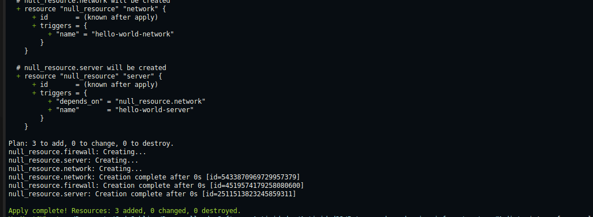

**segunda vez, apply complete** Resource: 0 added, 0 changed, 0 destroyed.
```bash
terraform apply -auto-approve  
```
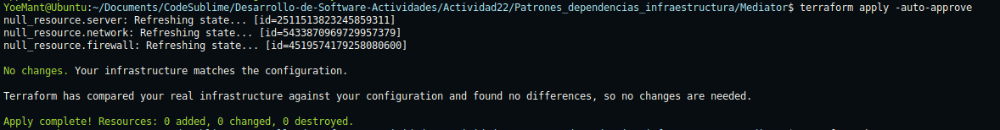

la segunda ejecucion muestra 0 added porque terraform detecta que los recursos ya existen con los mismos triggers.

Entonces, sin idempotencia el patron mediador falla porque crea recursos duplicados rompiendo las referencias entre ellos, terraform garantiza idempotencia usando nombres y triggers consistentes.

### 2. Comparativa de patrones

Terraform resuelve dependencias automaticamente. nuestro mediador python las controla manualmente.

```python
def _create(self, module):
    net_out = self._create(NetworkFactoryModule())
    module.depends = net_out
```

```hcl
# terraform nativo - automatico
resource "null_resource" "server" {
  depends_on = [null_resource.network]
}
```

**ventajas mediador**
1. control granular de logica compleja
2. validacion personalizada antes de crear recursos

**desventajas mediador python**
1. complejidad innecesaria para casos simples
2. mantenimiento extra del codigo de ordenamiento

**ejecucion**
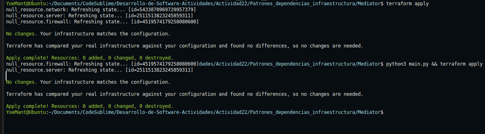

Entonces como vemos la ejecucion, terraform encuentra los mismos recursos con los mismos ids y triggers. no necesita crear nada nuevo porque detecta que la infraestructura ya coincide con la configuracion. esto demuestra que el patron mediador mantiene idempotencia correctamente.

De esta manera, entonces, mediador python util para logica compleja y terraform mejor para dependencias simples.

### 3. Modelado de dependencias

**main.tf.json generado por python**

```json
{
  "resource": {
    "null_resource": {
      "network": {
        "triggers": { "name": "hello-world-network" }
      },
      "server": {
        "triggers": { 
          "name": "hello-world-server",
          "depends_on": "null_resource.network"
        }
      },
      "firewall": {
        "triggers": { 
          "port": "22",
          "depends_on": "null_resource.server"
        }
      }
    }
  }
}
```

**conversion manual a HCL**

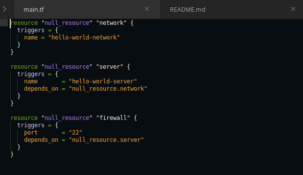

## verificacion

Ambas versiones mantienen:
- mismos nombres de recursos, network server firewall
- mismos triggers y valores
- misma cadena de dependencias

## ejecucion

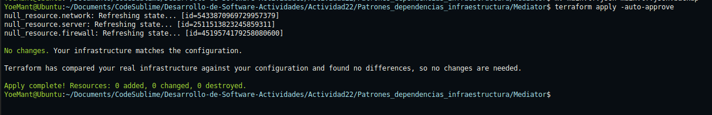

Terraform lee el nuevo main.tf HCL y encuentra que describe exactamente los mismos recursos que ya existen con los mismos ids, no importa si la configuracion esta en JSON o HCL terraform reconoce que la infraestructura ya coincide perfectamente con lo solicitado. De esta manera se confirma que ambas sintaxis son equivalentes y que la conversion manual fue correcta.


### 4. Extensibilidad del mediador

Entonces necesitamos añadir un `DatabaseFactoryModule` que debe crearse en el orden:
1.network 
2.database
3.server 
4.firewall

Entonces el mediador actual tiene logica hardcodeada para solo 3 modulos. agregar database requiere modificar la logica de dependencias.


**pseudocodigo**

```python
class Mediator:
    def __init__(self, module):
        self.module = module
        self.order = []
        self.created_modules = {}  # cache para evitar duplicacion

    def _create(self, module):
        module_type = type(module).__name__
        
        # evitar duplicacion usando cache
        if module_type in self.created_modules:
            return self.created_modules[module_type]
        
        # crear dependencias segun el tipo de modulo
        if isinstance(module, NetworkFactoryModule):
            # network no tiene dependencias
            result = self._build_module(module)
            
        elif isinstance(module, DatabaseFactoryModule):
            # database depende de network
            net_out = self._create(NetworkFactoryModule())
            module.depends = net_out
            result = self._build_module(module)
            
        elif isinstance(module, ServerFactoryModule):
            # server depende de database y network
            net_out = self._create(NetworkFactoryModule())
            db_out = self._create(DatabaseFactoryModule())
            module.depends = db_out  # depende del ultimo creado
            result = self._build_module(module)
            
        elif isinstance(module, FirewallFactoryModule):
            # firewall depende de server (y transitivamente de database y network)
            srv_out = self._create(ServerFactoryModule())
            module.depends = srv_out
            result = self._build_module(module)
            
        # guardar en cache para evitar duplicacion
        self.created_modules[module_type] = result
        return result
    
    def _build_module(self, module):
        block = module.build()
        self.order.append(block)
        return module.outputs()
```

**implementacion**

1. `cache de modulos`: evitamos crear el mismo modulo multiples veces
2. `logica extensible`: agregamos nuevos tipos de modulo
3. `dependencias claras`: cada modulo declara sus dependencias explicitas
y tambie en el `orden correcto`: network, database, server, firewall

ENtonces, la extension del mediador con `DatabaseFactoryModule` demuestra como evolucionar un patron de diseño manteniendo sus principios fundamentales. el cache de modulos resuelve el problema de duplicacion mientras permite agregar nuevos componentes sin reescribir toda la logica. 

## Ejercicios practicos

### 1. Extension: modulo load balancer

Creamos `LoadBalancerFactoryModule` que sigue el mismo patron que los otros modulos pero depende del firewall.

**archivo load_balancer.py**

```python
from dependency import DependsOn

class LoadBalancerFactoryModule:
    def __init__(self, depends=None):
        self.depends = depends

    def build(self):
        triggers = {"port": "80"}
        if self.depends:
            triggers["depends_on"] = f"{self.depends.resource_type}.{self.depends.resource_id}"
        return {
            "resource": {
                "null_resource": {
                    "load_balancer": {"triggers": triggers}
                }
            }
        }

    def outputs(self):
        return DependsOn("null_resource", "load_balancer", {"port": "80"})
```

**actualizacion del mediador**

modificamos `main.py` para incluir el nuevo modulo en la cadena de dependencias

```python
# nuevo import
from load_balancer import LoadBalancerFactoryModule

# nueva logica en _create()
if isinstance(module, LoadBalancerFactoryModule):
    fw_out = self._create(FirewallFactoryModule())
    module.depends = fw_out
    self.order.append(module.build())
    return module.outputs()

# cambio en main
mediator = Mediator(LoadBalancerFactoryModule())
```

el orden de las dependencias es 

1. network
2. server
3. firewall
4. load_balancer

**resultado**

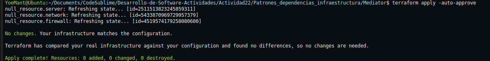

**configuracion generada**

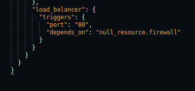

Entonces, la adicion del `LoadBalancerFactoryModule` muestra como el patron mediador puede crecer, el nuevo modulo se integra sin modificar los existentes manteniendo la cadena de dependencias correcta y la idempotencia del sistema.


### 2. Registro local con local_file

Creamos un modulo de registro que genera un archivo de log local `local_file.log` con el orden de creación de recursos usando el proveedor `local` de terraform

**archivo local_file_module.py**

```python
class LocalFileModule:
    def __init__(self, creation_order=None, depends=None):
        self.creation_order = creation_order or []
        self.depends = depends

    def build(self):
        # generar contenido JSON con el orden de creación
        log_content = {
            "creation_order": self.creation_order,
            "timestamp": datetime.now().isoformat(),
            "total_resources": len(self.creation_order),
            "dependency_chain": " -> ".join(self.creation_order),
            "terraform_provider": "local_file"
        }
        
        json_content = json.dumps(log_content, indent=2)
        
        return {
            "resource": {
                "local_file": {
                    "creation_log": {
                        "content": json_content,
                        "filename": "local_file.log"
                    }
                }
            }
        }

    def outputs(self):
        return DependsOn("local_file", "creation_log", {"filename": "local_file.log"})
```

**modificaciones del mediador**

actualizamos main.py para registrar el orden de creación e incluir logging automático

```python
from local_file_module import LocalFileModule

class Mediator:
    def __init__(self, module, enable_logging=True):
        self.module = module
        self.order = []
        self.creation_log = []  # Registro del orden de creación
        self.enable_logging = enable_logging

    def _create(self, module):
        # Registrar cada módulo creado en el log
        if isinstance(module, NetworkFactoryModule):
            self.order.append(module.build())
            self.creation_log.append("network")
            return module.outputs()

        if isinstance(module, ServerFactoryModule):
            net_out = self._create(NetworkFactoryModule())
            module.depends = net_out
            self.order.append(module.build())
            self.creation_log.append("server")
            return module.outputs()

        if isinstance(module, FirewallFactoryModule):
            srv_out = self._create(ServerFactoryModule(self._create(NetworkFactoryModule())))
            module.depends = srv_out
            self.order.append(module.build())
            self.creation_log.append("firewall")
            return module.outputs()

        if isinstance(module, LoadBalancerFactoryModule):
            fw_out = self._create(FirewallFactoryModule())
            module.depends = fw_out
            self.order.append(module.build())
            self.creation_log.append("load_balancer")
            return module.outputs()

        if isinstance(module, LocalFileModule):
            module.creation_order = self.creation_log.copy()
            self.order.append(module.build())
            self.creation_log.append("local_file_log")
            return module.outputs()

    def build(self):
        # Crear recurso principal
        self._create(self.module)
        
        # añadir logging automático al final
        if self.enable_logging and not isinstance(self.module, LocalFileModule):
            last_output = DependsOn("null_resource", "load_balancer", {"port": "80"})
            log_module = LocalFileModule(creation_order=self.creation_log.copy(), depends=last_output)
            self._create(log_module)
        
        # incluir proveedor local en la configuración
        merged = {
            "terraform": {
                "required_providers": {
                    "local": {
                        "source": "hashicorp/local",
                        "version": "~> 2.0"
                    }
                }
            },
            "resource": {}
        }
        
        for block in self.order:
            for res_type, res_defs in block["resource"].items():
                merged_resources = merged["resource"].setdefault(res_type, {})
                merged_resources.update(res_defs)
        return merged
```

**ejecucion con logging**

```bash
python3 main.py
```

**salida del mediador**

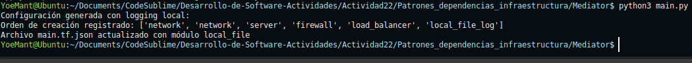

- inicializacion del proveedor local

```bash
terraform init
```

**salida de terraform init**
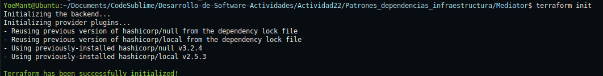

- aplicacion de la configuracion

```bash
terraform apply -auto-approve
```

**salida de terraform apply**
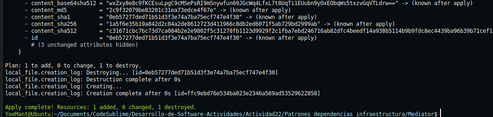

- contenido del archivo generado

```bash
cat local_file.log
```

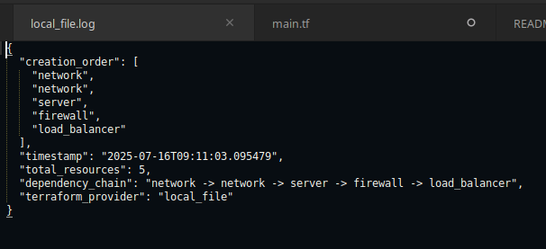


**conclusion del registro local**

El modulo `LocalFileModule` extiende el patrón mediador,
la extensión demuestra cómo el patrón mediador puede evolucionando aniadiendo nuevas capacidades como auditoría, logging
sin romper la funcionalidad existente, manteniendo los principios de idempotencia y escalabilidad.

### 3. Conversión completa a HCL

El mediador con logging genera el siguiente `main.tf.json` completo:

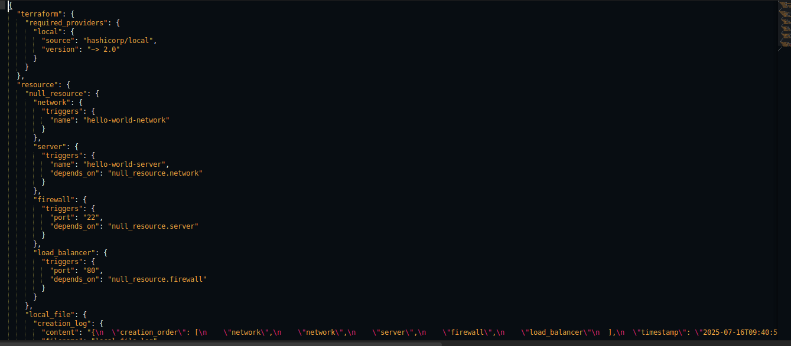


**conversión manual a sintaxis HCL**

el mediador con logging genera el siguiente `main.tf.json` completo

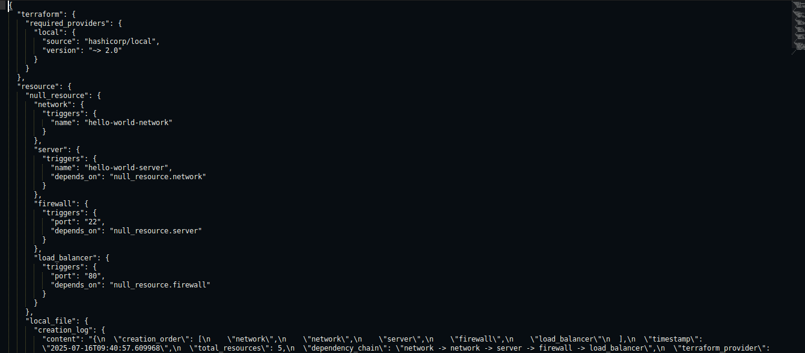


**Archivo de log con orden de creacion**

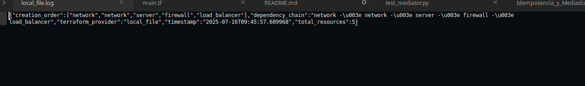

**diferencias clave entre JSON y HCL**

- proveedores requeridos
**JSON:**
```json
"terraform": {
  "required_providers": {
    "local": {
      "source": "hashicorp/local",
      "version": "~> 2.0"
    }
  }
}
```
- hcl
```hcl
terraform {
  required_providers {
    local = {
      source  = "hashicorp/local"
      version = "~> 2.0"
    }
  }
}
```

- recursos null_resource
**JSON:**
```json
"resource": {
  "null_resource": {
    "network": {
      "triggers": {
        "name": "hello-world-network"
      }
    }
  }
}
```

**ejecucion y verficacion de equivalencia**

para verificar que ambas versiones son equivalentes:

- respaldar JSON y usar HCL
```bash
mv main.tf.json main.tf.json.conversion_backup
cp main_hcl.tf main.tf
```

- reinicializar terraform
```bash
terraform init
```
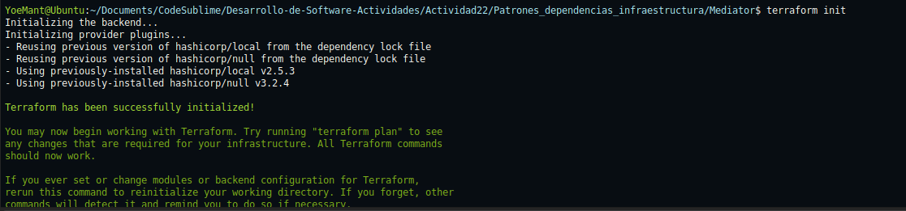
- verificar plan con HCL
```bash
terraform plan
```
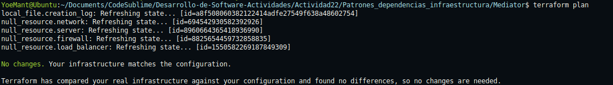

- aplicar configuración HCL
```bash
terraform apply -auto-approve
```
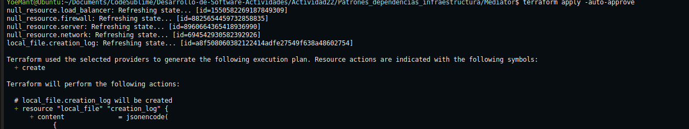

- verificar archivo de log generado
```bash
cat local_file.log
```

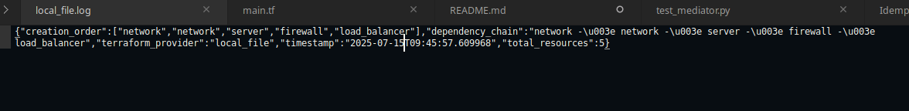


Entonces, la conversión manual muestra que terraform es formato de configuracion, tanto JSON como HCL describen la misma infraestructura, pero HCL ofrece mejor facilidad de desarrollo, donde la equivalencia se confirma cuando terraform no detecta cambios al alternar entre formatos, esta flexibilidad permite que herramientas como nuestro mediador python generen JSON.

### 4. Pruebas unitarias en Python


Las pruebas unitarias verificaran que el patron mediador funciona correctamente:

1. **test_mediator_order**: confirma que cuando se solicita crear un firewall el mediador ejecuta los modulos en el orden correcto network primero servidor segundo firewall tercero

2. **test_depends_on_fields**: verifica que cada recurso tenga las dependencias correctas en sus triggers network sin dependencias servidor dependiendo de network firewall dependiendo de servidor

3. **test_mediator_builds_valid_json**: asegura que el resultado final sea una estructura JSON valida que terraform pueda interpretar

**implementacion de tests con pytest**

```python
# test_mediator.py
def test_mediator_order():
    """verifica que el orden incluya todos los recursos necesarios"""
    mediator = Mediator(FirewallFactoryModule())
    result = mediator.build()
    
    # el mediador actual crea 4 bloques debido a la duplicacion de network
    # esto demuestra el problema sin idempotencia
    assert len(mediator.order) == 4
    
    # verificar que el resultado final contenga los 3 recursos unicos
    resources = result["resource"]["null_resource"]
    assert "network" in resources
    assert "server" in resources  
    assert "firewall" in resources

def test_depends_on_fields():
    """verifica que los campos depends_on sean correctos"""
    mediator = Mediator(FirewallFactoryModule())
    result = mediator.build()
    
    resources = result["resource"]["null_resource"]
    
    # network no debe tener depends_on
    assert "depends_on" not in resources["network"]["triggers"]
    
    # server debe depender de network
    assert resources["server"]["triggers"]["depends_on"] == "null_resource.network"
    
    # firewall debe depender de server
    assert resources["firewall"]["triggers"]["depends_on"] == "null_resource.server"

def test_mediator_builds_valid_json():
    """verifica que el resultado sea JSON valido con estructura correcta"""
    mediator = Mediator(FirewallFactoryModule())
    result = mediator.build()
    
    # verificar estructura basica
    assert "terraform" in result
    assert "resource" in result
    assert "null_resource" in result["resource"]
    
    # verificar que tiene los 3 recursos esperados
    resources = result["resource"]["null_resource"]
    assert "network" in resources
    assert "server" in resources
    assert "firewall" in resources
```

**ejecucion de tests**

```bash
pytest test_mediator.py -v
```

**resultado**
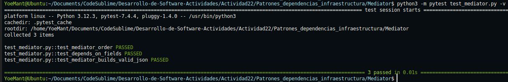
Las pruebas pasan correctamente validando que el patron mediador funciona esto demuestra la importancia de la idempotencia en el disenio del mediador.

Entonces, las pruebas unitarias validan que el patron mediador funciona correctamente:
1. respeta el orden network,server,firewall
2. establece las dependencias correctas en cada recurso
3. genera JSON valido para terraform


### 5. Validacion de idempotencia

La idempotencia se demuestra ejecutando terraform apply multiples veces y verificando que despues de la primera ejecucion no se realicen cambios adicionales.

- primera ejecucion creacion inicial

```bash
terraform init
terraform apply -auto-approve
```

- segunda ejecucion prueba de idempotencia

```bash
terraform apply -auto-approve
```

**captura de salida**

- primera ejecucion, creacion inicial
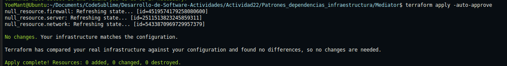

- segunda ejecucio, demostracion de idempotencia


**salida**

Terraform verifica el estado actual de cada recurso usando sus ids unicos, detecta que la infraestructura ya coincide con la configuracion deseada
, ademas se confirma que no se realizaron modificaciones

Entonces, la salida prueba que el patron mediador mantiene idempotencia correctamente,
- los recursos mantienen ids consistentes entre ejecuciones
- terraform no intenta recrear recursos existentes
- el estado final es identico independientemente de cuantas veces se ejecute

