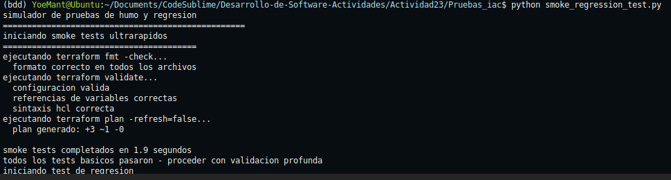

# Actividad 23

**configurar entorno**
```bash

python3 -m venv bdd && source bdd/bin/activate
pip install pytest jsonschema netaddr requests

```
**ejecutar las pruebas**
```bash
pytest
```
**estado del proyecto**


todas las pruebas pasan sin errores y validan los conceptos de iac localmente

## ejercicio 1: estrategia de testing combinada

**diseño de modulos terraform**

Se define las interfaces, cada modulo terraform debe funcionar como una caja negra con entradas y salidas, con esto permite que diferentes equipos puedan usar los modulos sin conocer su implementacion interna.

El **modulo network** es la base que gestiona redes vpc y subredes, este recibe parametros como nombre de red, bloque cidr y numero de subredes deseadas. valida que el cidr tenga espacio suficiente para crear las subredes solicitadas, entonces devuelve identificadores de red y subredes que otros modulos pueden usar.

El **modulo compute** depende del modulo network pero puede probarse independientemente usando datos simulados, se maneja la creacion de instancias y load balancers, recibe el numero de instancias, tipo de maquina y subredes donde desplegarlas. devuelve ips y identificadores que pueden usarse para configuracion adicional.

El **modulo storage** es completamente independiente y maneja buckets, recibe configuracion de almacenamiento y encriptacion, devuelve urls y identificadores necesarios para que aplicaciones accedan al storage.

**validacion de casos limite**

Las pruebas unitarias y de contrato deben detectar errores comunes antes de que lleguen a produccion. rangos cidr mal configurados son una fuente frecuente de problemas. si solicitas 10 subredes /24 en una red /28, matematicamente es imposible. los tests deben detectar esto inmediatamente. Conteos de instancias invalidos como cero o numeros negativos indican errores en la configuracion. nombres con caracteres especiales pueden causar problemas en diferentes proveedores de nube. 

**metrica de cobertura**

Aqui medimos que porcentaje de outputs declarados tienen tests que los validan, no todos los outputs son igual de importantes. Los outputs criticos como identificadores de recursos deben tener 100% cobertura porque otros modulos dependen de ellos. si falla la creacion de network_id, todos los modulos que dependen de la red fallan en cascada.Estos outputs funcionales como ips y urls son importantes pero menos criticos. 80% cobertura es suficiente porque son mas faciles de debuggear cuando fallan.

**ejecucion**

Se muestra como medir cobertura de contratos en la practica. el archivo `coverage_report.py` se analiza tres modulos simulados y genera metricas.

```bash
python coverage_report.py
```


El script distingue entre outputs requeridos y opcionales asignando diferentes niveles de importancia. Los outputs criticos como network_id requieren 100% cobertura mientras que outputs auxiliares pueden tener menor cobertura.

El reporte muestra cobertura por modulo y cobertura promedio del proyecto completo, incluye recomendaciones automaticas basadas en umbrales configurables. Este enfoque permite cambiar la  cobertura de contratos en pipelines.


## ejercicio 2: pruebas de integracion entre modulos

Se valida que modulos terraform funcionen correctamente cuando se integran manteniendo aislamiento para pruebas confiables.

### ejecucion de pruebas

- secuenciacion entre modulos
```bash
python3 integration_test.py
```


- testing con contenedores simulados  
```bash
python3 container_test.py
```


**secuenciacion de dependencias**: en el siguiente orden network, compute, storage usando archivos de estado json,  cada modulo lee outputs del anterior como inputs. data sources locales preservan inmutabilidad sin scripts externos.

**entornos con contenedores**: contenedor postgres simulado que instancias terraform deben alcanzar. incluye preparacion de entorno, ejecucion terraform y validacion de conectividad end-to-end.

**aislamiento y limpieza**: cada test ejecuta en namespace separado con recursos propios. cleanup automatico remueve contenedores y archivos temporales incluso si tests fallan. puertos dinamicos evitan conflictos.

**testing gradual**: nivel superficial valida formato de outputs, el nivel profundo ejecuta flujos completos de datos y de manera superficial para CI rapido, profundo para validacion completa pre-release.

**ejecucion**

Los scripts `integration_test.py` y `container_test.py` demuestran estos conceptos funcionalmente. simulan integracion realista sin infraestructura real validando la coneccion y dependencias entre componentes.

## ejercicio 3: pruebas de humo y regresion

Se establece para deteccion rapida de errores basicos y validacion de cambios no deseados.

**ejecucion de pruebas**

```bash
python smoke_regression_test.py
```

**smoke tests ultrarapidos**:
`terraform fmt -check` valida formato y espaciado sin modificar archivos. 
`terraform validate` verifica sintaxis HCL y referencias de variables sin acceso remoto.
`terraform plan -refresh=false` genera plan sin consultar APIs externas validando lógica de configuración.
fmt detecta inconsistencias cosméticas que causarían ruido en diffs posteriores, validate atrapa errores de configuración que harían fallar plan/apply inmediatamente, plan con refresh=false valida dependencias y lógica sin overhead de red, detectando 80% de problemas en segundos.

**planes golden**: generar planes de referencia versionados que sirven como baseline, normalizacion para remover campos variables como timestamps, uuids. La comparacion semantica enfocada en resource_changes y planned_values.

**politica de actualizacion**: actualizar planes dorados solo en releases oficiales con revision de minimo dos desarrolladores senior. criterios objetivos para aprobar cambios basados en requirements documentados y backward compatibility.

**ejecucion**

el script `smoke_regression_test.py` demuestra smoke tests rapidos, generacion de planes dorados, normalizacion para comparacion y proceso de aprobacion de cambios. simula deteccion de regresiones y validacion de criterios de calidad.
