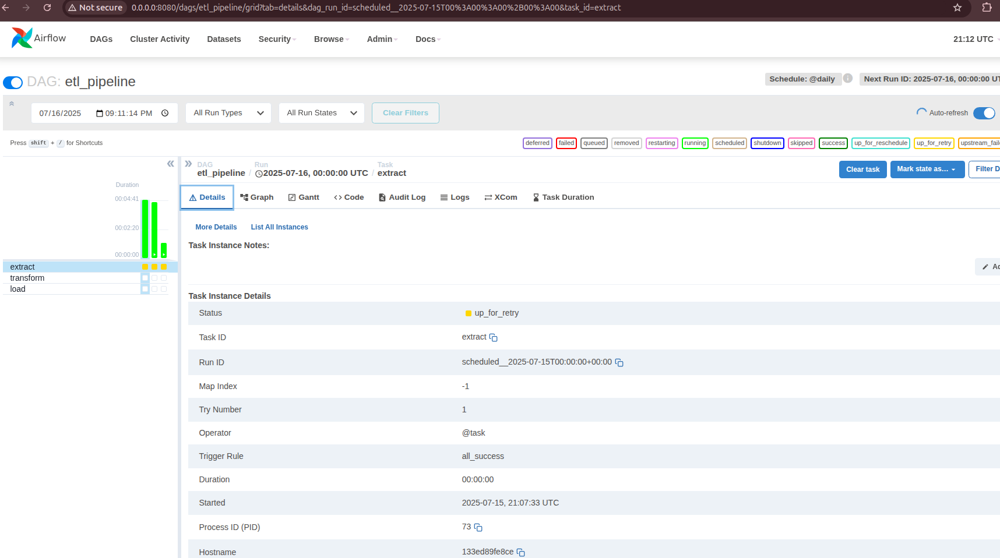

# **Actividad 24: Introduccion a Docker, ETL en Docker Compose**

Este proyecto implementa un sistema ETL automatizado que procesa datos usando Docker y Apache Airflow, el sistema toma un archivo CSV
con datos simples que contiene nombres y valores numericos lee estos datos calcula el cuadrado de cada valor y guarda los resultados en una base de datos postgresql.
El resultado final es un sistema que procesa datos automaticamente transformando valores como 2 en 4 y 3 en 9 y almacenandolos en la base de datos de forma programada y monitoreada

**Ejecucion**

Sigue estos pasos para configurar y ejecutar el proyecto.


**1. Construir e iniciar los servicios**


Construye las imagenes de Docker y arranca los contenedores en modo detached:

```shell
docker-compose up -d --build
```
- Construimos las imagenes `etl-app` y los servicios de airflow.
- Se inicia los contenedores, `postgres`, `etl-app`, `airflow`, `airlofw-webser` y `airflow-scheduler`
- se configura la base de datos y el usario administrador.


**2. Verificamos los contenedores**


Confirma que todos los contenedores estan en ejecucion:

```shell
docker ps
```


**3. Monitorea los logs**

abrimos terminales adicionales para continuar con los logs en tiempo real:

- **Webserver de Airflow**:

    ```shell
    docker-compose logs -f airflow-webserver
    ```

    

- **Scheduler de Airflow**:

    ```shell
    docker-compose logs -f airflow-scheduler
    ```

    

**4. Accede a la interfaz de Airflow**


1. crear un usuario `admin`

```text
docker-compose exec airflow-webserver airflow users create \
  --username admin \
  --firstname Admin \
  --lastname User \
  --role Admin \
  --email admin@example.com \
  --password admin
```


1. Abre tu navegador en: [http://localhost:8080]

2. Inicia sesion con:

    - **Usuario**: `admin`

    - **Contraseña**: `admin`

  


1. Navega a la vista principal de DAGs: [http://localhost:8080/home](http://localhost:8080/home).

2. Busca el DAG `etl_pipeline` y haz clic en el boton **Trigger DAG** (icono de reproduccion).

  

1. Observa como las tareas (`extract`, `transform`, `load`) se ejecutan secuencialmente en la vista **Graph** o **Grid**.

  

**5. Verifica los datos en PostgreSQL**

Para confirmar que los datos se han cargado correctamente en la base de datos:

```shell
docker exec -it proyecto_etl_docker_airflow-postgres-1 psql -U user -d etl_db -c "SELECT * FROM processed_data Limit 10;"
```

**Salida esperada**:

 

**7. Detener y limpiar**

Para detener y eliminar los contenedores, redes y volúmenes:

```shell
docker-compose down -v
```

