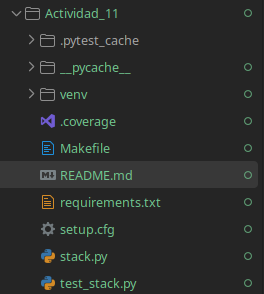
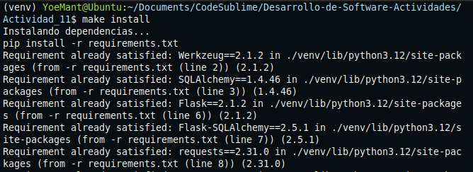
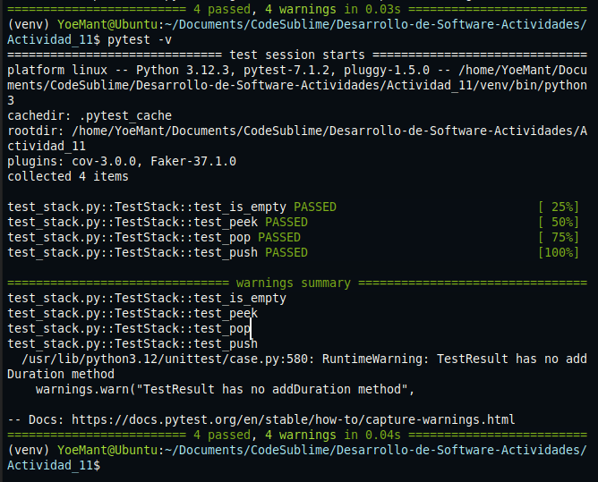

# Actividad 11

## 1. Estructura del proyecto y configuracion



### Se ejecuta make install, este activa automaticamente el entorno configurado porque el Makefile:

* **`requirements.txt`**
* **`setup.cfg`**
* **`Makefile`**

---


## Paso 1: Verificar si la pila está vacía

**Se escribió una prueba para confirmar que la pila se comporta correctamente al estar vacía o no.**

```python
def test_is_empty(self):
    self.assertTrue(self.stack.is_empty())
    self.stack.push(5)
    self.assertFalse(self.stack.is_empty())
```

**Resultado al ejecutar `pytest -v`:**
- Prueba pasada correctamente


## Paso 2, Escribiendo aserciones para el método peek()

**se modifica el metodo `test_peek()` para obtener el elemento superior sin removerlo**

```python
def test_peek(self):
    self.stack.push(3)
    self.stack.push(5)
    self.assertEqual(self.stack.peek(), 5)
```


## Paso 3, Escribiendo aserciones para el método pop()
**se modifica el metodo `test_pop()` para Remover el elemento superior**

```python
def test_pop(self):
    self.stack.push(3)
    self.stack.push(5)
    self.assertEqual(self.stack.pop(), 5)
    self.assertEqual(self.stack.peek(), 3)
    self.stack.pop()
    self.assertTrue(self.stack.is_empty())
```


## Paso 4,Escribiendo aserciones para el método push()
 **El metodo `push()` añadir un nuevo elemento a la pila**

```python
def test_push(self):
    self.stack.push(3)
    self.assertEqual(self.stack.peek(), 3)
    self.stack.push(5)
    self.assertEqual(self.stack.peek(), 5)
```


## Paso 5, ejecutamos `pytest-v` para verificar todas las pruebas
**Resultado**
 - Todas las pruebas pasaron correctamente sin errores, lo que confirma que la clase `Stack` esta funcionando correctamente.




